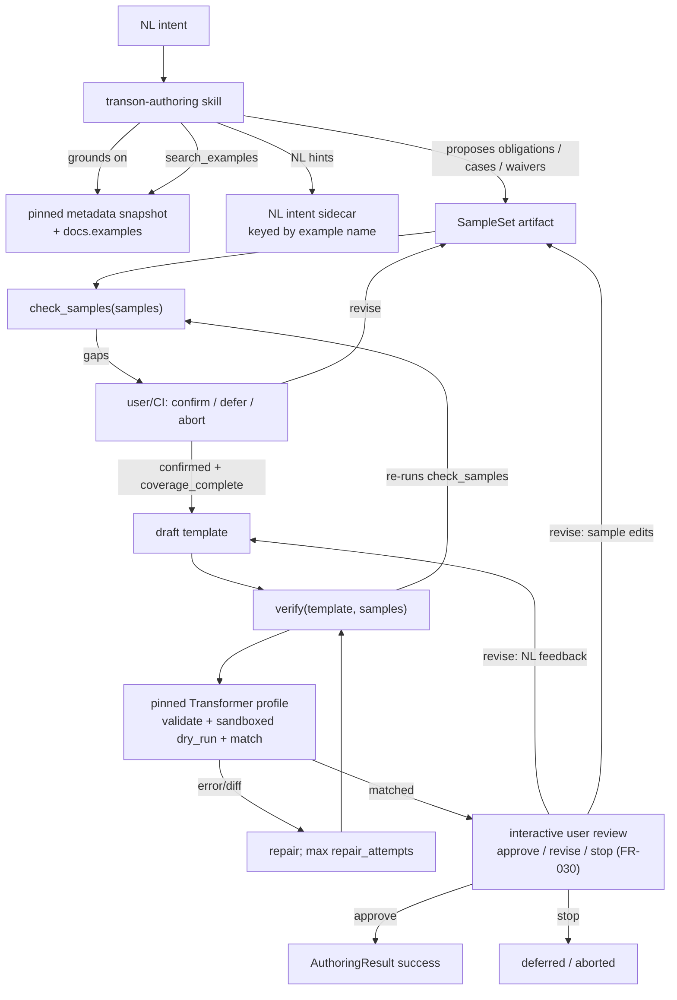

# ARCHITECTURE — Transon Authoring Skill (`transon-authoring`)

Architecture, architecture decision records (`AD-*`), and package layout for
`transon-authoring`. Normative: this file is part of the contract.

> **Contract split.** The contract spans three documents: [`SPEC.md`](SPEC.md) (§0–4, §7–9,
> §11–13, §17 — goals, requirements, normative contracts, governance, gates, traceability),
> [`ARCHITECTURE.md`](ARCHITECTURE.md) (§5, §6, §10 — architecture, decision records, package
> layout), and [`ROADMAP.md`](ROADMAP.md) (§14–16, §18 — milestones, open questions, risks,
> readiness). **Section numbers are global and unique across all three**, so a reference such as
> §6 or §11.9 is unambiguous wherever it appears. Requirement IDs (FR/NFR/AC/UC/AD/OQ) are
> append-only and never renumber (§12).

---

## 5. Architecture



Non-interactive/CI runs have no reviewer: `matched` is emitted directly after `verify` (FR-030).

**Runtime (AD-006):** Python library is the contract; agents/CI use `python -m transon_authoring`.
No console-script product; no MCP.

---

## 6. Architecture decisions

- **AD-001 — Skill package.** Standalone repo/package (`SKILL.md` + resources + library).
- **AD-002 — Engine-dependent.** May/must embed the engine; does not inherit editor AD-008.
- **AD-003 — Engine is authority.** See AD-018 for precedence among engine, SPECIFICATION, snapshot.
- **AD-004 — Verify-before-return.** Success only if `verify` → `ok: true`, `assurance: "matched"`.
  `verify` **re-validates** the SampleSet via `check_samples` and rejects unless
  `ok_for_verify` (AD-019). Structured failure otherwise (§11.5).
- **AD-005 — Single-source, multi-tool.** One **editable** `SKILL.md`; generated copies are
  gate-enforced byte-identical to it (FR-037a / AC-040); Claude + Cursor adapters; parity gate.
- **AD-006 — Library-first; module entry.** APIs: `get_metadata`, `search_examples`,
  `check_samples`, `verify` (+ debug `validate` / `dry_run`). Invoked via
  `python -m transon_authoring` (§11.6).
- **AD-007 — Pin + drift + upgrade.** Depend on **`transon==0.2.3`**. Bundle the
  `get_editor_metadata()` snapshot **and the `get_language_reference()` Language Reference
  snapshot (AD-026)** with provenance (`engine_version`, `metadata_version`, `reference_version`,
  content hashes, sync date). **Drift gate** compares the bundles to the metadata and Language
  Reference produced by the **pinned** install — it does **not** detect newer PyPI releases.
  **Staleness/upgrade:** a scheduled or manual check against PyPI/latest engine opens a pin-bump
  PR; humans run `sync-metadata` (resyncing both the metadata snapshot and the Language Reference
  snapshot, FR-036/AD-026), update the `pyproject.toml` pin, refresh the NL sidecar, re-mint the
  FR-029 synthetic corpus and re-audit the refuse bucket (§11.8), reset `evals/baseline.json`
  (§11.8), and merge deliberately (OQ-004 still applies for automation shape).
- **AD-008 — Ordinary JSON output.** No IR/DSL; no verifier-owned key-order canonicalization.
- **AD-009 — Convention-first install; plugin distribution second.** Native Claude/Cursor paths
  (§11.9) are the primary channel. A Claude Code plugin form plus a self-hosted marketplace
  manifest is the secondary channel (FR-037); third-party catalogs are outreach, not a gate.
  No MCP.
- **AD-010 — Eval-driven improvement.** Changes gated by NFR-010 / AD-020.
- **AD-011 — Measurement before skill body.** A2 before A3.
- **AD-012 — Pinned engine package; local execution only.** Verification depends on the pinned
  `transon` **Python package** loaded in the same environment — no hosted HTTP, WASM/Pyodide, or
  MCP. Dry-run cases MAY run in a **short-lived local worker subprocess** that imports that same
  package (AD-017 timeout isolation). That is still local/embedded execution, not a remote engine.
- **AD-013 — Engine-valid under v1 profile; no editor-surface awareness.** Output may be any
  template valid for the **v1 execution profile** (AD-017), not “any conceivable engine subclass.”
  No in-surface check/disclosure.
- **AD-014 — Samples before draft.** No draft until `coverage_complete` and user/CI confirmation
  are both true (separate flags — AD-016). CI uses pre-confirmed fixtures.
- **AD-015 — Sandboxed `file` / `include`.** In-memory write capture + explicit `includes` map;
  forbid real FS/network in dry-run. Expected writes live on sample cases.
- **AD-016 — Obligations in SampleSet; deterministic `check_samples`.** Model proposes coverage
  obligations; user/CI accepts/rejects them and confirms the SampleSet. `check_samples` only
  checks the artifact — it never parses NL. **`coverage_complete` ≠ `confirmed`.**
- **AD-017 — v1 execution profile (how verify executes).** `verify` / dry-run **always construct**
  `transon.Transformer` with:
  - the base class only (never a subclass);
  - built-in rule/operator/function registries as shipped in the pinned package;
  - default marker `"$"` (`Transformer.DEFAULT_MARKER`);
  - `max_include_depth=50` (engine default);
  - sandboxed `file_writer` + `template_loader` (AD-015);
  - the engine’s R-32 **one core recursion frame per template node** (at the pinned engine;
    over-depth surfaces as include `TransformationError`, never raw `RecursionError`);
  - per-case wall-clock timeout **5s**, enforced by running each dry-run case in a **local worker
    subprocess** that imports the pinned package, applies the same sandbox delegates, and returns
    `{result, writes, errors}` over IPC. On timeout the worker is killed → `TimeoutError`,
    `failed_stage: "dry_run"`. Subprocess isolation does not change match semantics (NFR-002): same
    SampleSet + template + pin ⇒ same Verdict. Sandbox invariants (AD-015) hold inside the worker
    (no FS/network). The library/CLI **MUST NOT** expose knobs for non-default marker, transformer
    class, or registries in v1; explicit requests for those are rejected with `ProfileError` before
    any engine call (AC-027). Trust boundary: trusted local agents/CI only.
- **AD-018 — Authority precedence.** (1) behavior of the **pinned running engine**;
  (2) the engine's author-facing Language Reference — packaged in the pinned wheel, exported by
  `get_language_reference()` and surfaced by the `language` subcommand (AD-026) — for the
  **shipped skill surface**, with the engine repo `docs/SPECIFICATION.md` remaining a
  **maintainer-only** design-time authority for that version; (3) pinned `get_editor_metadata()`
  snapshot for catalog/examples structure; (4) NL intent sidecar (hints only). Never LLM memory /
  web / Context7 for Transon semantics (NFR-001).
- **AD-019 — `verify` re-checks SampleSet.** No unforgeable token. `verify` runs `check_samples`
  on the provided SampleSet and requires `ok_for_verify` before validate/dry_run/match.
- **AD-020 — Eval runner policy (resolves OQ-009).** See §11.8. Committed `evals/runner.json`
  pins provider/model/settings; 3 runs/fixture majority-of-3; population = all committed fixtures;
  ratchet and privacy rules normative.
- **AD-021 — Synthetic eval corpus from `docs.examples`; small-model primary gate (resolves
  OQ-024; absorbs RFC-001).** The pinned snapshot's flat `docs.examples` corpus is an allowed
  **fixture factory** for the FR-017 improvement loop:
  any example MAY seed exactly one EvalFixture (v1 commits only the FR-029 tagged subset of
  ~25–30 selected seeds; later waves may extend toward all 121). A seeded fixture's SampleSet
  outputs come **only** from executing the
  seed template under the pinned engine's AD-017 profile (never model memory, never the snapshot
  `result` taken on faith — the corpus pair is re-executed). The **seed template is
  provenance-only**: committed under `evals/seeds/` (FR-029), never placed in the fixture object,
  the eval prompt, or the tools path of the skill under test; scoring stays behavioral
  (`assurance: "matched"` against the fixture SampleSet, §11.8), never seed-template recovery.
  Synthetic `intent_nl` is LLM-drafted (grounded on the example `doc` and, when present, the
  NL sidecar entry) but **human-accepted before commit** — never auto-committed. The primary
  NFR-010 gate model is a **small model** (pin: `claude-haiku-4-5-20251001`), so `SKILL.md` is
  driven to work without a frontier model; the gate-model swap and any later gate-model change
  are explicit eval-policy commits per §11.8. Synthetic SampleSets are **evals/CI fixtures
  only** — they never substitute for user confirmation in interactive authoring (AD-014/AD-016
  untouched).
- **AD-022 — Observability: mechanical records over self-report.** Two
  layers. (1) The skill MAY self-report an ordered `trace` in `AuthoringResult` (§11.5,
  FR-031) — **diagnostic only**: never an input to scoring, gating, or `verify`, and never
  trusted as evidence a step actually ran (a model can misreport its own steps). (2) The
  **authoritative** step record is mechanical: eval episodes persist full tool-call transcripts
  and the `check_evals` report aggregates failure modes from submitted envelopes (§11.8,
  FR-032). Effectiveness questions — *which step failed, how often, at what cost* — are
  answered from layer 2; layer 1 adds narrative color in interactive sessions. Gates and
  determinism (NFR-002) are untouched: traces and transcripts are artifacts, never gate inputs.
- **AD-023 — Real-world structural fixture pack (constructed, engine-frozen).**
  The eval corpus (§11.8) MAY grow beyond the AD-021 synthetic-from-`docs.examples` set with a
  **third fixture class**: hand-authored EvalFixtures built from large, realistic-shape API
  payloads (AWS EC2, Stripe, GitHub webhooks, JOLT/JMESPath suites — see
  `docs/proposals/big-real-world-transform-samples.md`). These are **constructed** to match the
  documented API schemas (fake ids/values), never captured from a live account, so they carry no
  real-use data: `redacted: false`, **no** `consent` — the FR-018 / NFR-011 real-use capture path
  is untouched. **Honesty rule** (mirrors the AD-021 corpus pair): a fixture's case `output` is the
  **pinned engine's actual output** for an author-verified template, never a hand-written expected;
  the reference template is **provenance-only** (committed under `evals/seeds/`, FR-033 shape) and
  is **never** placed in the fixture object, the harness prompt, or the tools path (leakage rule,
  AD-021). An intent that needs a capability **genuinely absent from the pinned engine's
  function/operator surface** — as defined by the pinned metadata catalog and Language Reference
  (AD-018) — is authored as an `expect: "refuse"` fixture (AC-003), turning each engine gap into
  realistic adversarial coverage rather than an unsatisfiable matched fixture; because the engine's
  capability surface changes across pins (a repin can make a former gap authorable), an AD-007 repin
  **re-audits** which asks are still genuinely unsatisfiable and refills the refuse bucket with the
  new engine's real gaps (§11.8). Intents the pinned engine can satisfy — structural transforms and
  any authorable computation — are authored `expect: "matched"`. FR-033 fixes the provenance shape + engine-freeze gate; the
  pack is ongoing improvement-loop work (FR-017) and gates no milestone.
- **AD-024 — Real-host eval harness (Agent SDK reference; resolves OQ-027, absorbs RFC-002).** The NFR-010 gate measures `SKILL.md` **where it ships** — inside a real host
  agent harness with a rich tool suite (Read/Write/Edit/Bash/Glob/Grep, plus the host's `Skill`
  tool to load the skill body) and a mature loop — not
  the OQ-017 bespoke 3-tool `messages.create` loop, which measured a configuration that never
  ships and is strictly *harder* than production (false negatives; the gate did not predict
  production). The reference host is the **Claude Agent SDK**, **version-pinned** in
  `evals/runner.json` (`harness = { kind, version }`) exactly as the model is pinned, so the gate
  stays reproducible. Scope of the change: **only the harness that produces an EpisodeResult**.
  OQ-016 scoring (schema-valid + independent engine re-verify, AD-004), the SampleSet schema,
  `verify`, `check_samples`, the §11.8 buckets/ratchet/baseline, and every rate rule are
  **untouched** — a **deterministic host→EpisodeResult adapter** (OQ-027e) feeds the unchanged
  scorer. The retired raw loop (`scripts/eval_harness.py`) is **demoted to a non-gating offline
  smoke fixture** (OQ-027d), not deleted, so its fake-provider unit tests keep exercising loop
  logic offline. Because a real host runs **Bash** over untrusted fixture input inside the
  credential-holding dispatch workflow, adoption of the live run is **gated on the OQ-027f
  isolation contract** (ephemeral per-episode workspace, no credentials in the tool-execution
  sandbox, network egress denied, artifact controls) — the single biggest new risk. Changing the
  pinned `harness.kind`/`harness.version` is an eval-policy commit that resets `evals/baseline.json`
  (OQ-027b), mirroring the gate-model swap (§11.8 / OQ-024g). Determinism (NFR-002) is untouched:
  the harness is a measurement instrument, never a gate input beyond the EpisodeResult it produces.
- **AD-025 — Run-artifact observability: whole transcript + telemetry roll-up.**
  Extends the AD-022 mechanical record so a run answers *which step failed, how often, at what cost*
  (AD-022's own words) directly from artifacts. Beyond the scored `EpisodeTranscript` (FR-032), a
  `check_evals` run given `--transcripts-dir` also persists, per episode, the **whole host message
  transcript** (every turn's assistant text / thinking / tool-use / tool-result, including both
  turns of the OQ-027 review-approval path) and, per run, a **`run_summary.json`** telemetry
  roll-up — tokens, cost (`total_cost_usd` reported by the host), a tool-call histogram (steps by
  category), step/turn counts, outcomes and errors, plus normalized per-fixture cost. Same status as
  every FR-032 artifact: **additive, non-gating, never committed** (a run without `--transcripts-dir`
  scores identically); the scorer, targets, baseline, and lint are untouched. Because these are pure
  build artifacts they carry no `additionalProperties` schema pin and the scored `EpisodeTranscript`
  (§11.8) stays frozen. The recommended project location is the **git-ignored `evals/_runs/`** — so
  a run's full transcript and stats land in the working tree but never in git. A `--only ID[,…]`
  selector scopes the **provider run** to named fixtures for a cost/diagnostic probe while the
  NFR-011 lint still covers the full committed corpus.
- **AD-026 — Language Reference grounding + authority swap.** The engine's author-facing Language
  Reference (packaged `LANGUAGE.md`, exported by `get_language_reference()`) is a **second
  engine-derived grounding artifact**, snapshotted and treated **identically to the
  `get_editor_metadata()` catalog** (AD-007): `sync-metadata` dumps it to
  `resources/language-reference.json` with sha256 + `reference_version` provenance, `check_snapshot`
  drift-gates it against the pinned engine, and the read path is engine-import-free (FR-009/FR-036).
  Snapshotting over a live passthrough is deliberate: every authority change is a reviewable diff on
  the upgrade PR (AD-007 "not silent"), one mental model for all engine-derived grounding, and the
  whole grounding surface stays offline (NFR-003). This is the authority the **shipped skill** cites
  (AD-018 item 2, surfaced by the `language` subcommand), replacing the engine repo
  `docs/SPECIFICATION.md` — reachable on every install (§11.9) where no engine checkout exists. The
  engine `docs/SPECIFICATION.md` remains a **maintainer-only** design-time authority. `reference_version`
  is the reference's own semver (minor = additive, major = breaking); consumers MUST fail loudly on
  an unsupported major (§11.6 `language`, enforced at sync time).

---

## 10. Package layout

```
transon-authoring/
├── SKILL.md
├── pyproject.toml                 # depends on transon==0.2.3 (AD-007 pin)
├── src/transon_authoring/
│   ├── __main__.py                # §11.6
│   ├── verify.py
│   ├── samples.py
│   ├── metadata.py
│   ├── examples.py
│   ├── match.py                   # §11.4
│   └── schemas/                   # SampleSet, SampleCheck, Verdict, AuthoringResult, EvalFixture, …
├── resources/
│   ├── metadata-snapshot.json     # get_editor_metadata() pin
│   ├── metadata-snapshot.md       # provenance
│   ├── language-reference.json    # get_language_reference() pin (FR-036 / AD-026)
│   └── nl-intents.json            # NL sidecar by example name (FR-010)
├── adapters/claude/ … cursor/
├── .claude-plugin/
│   ├── plugin.json                # FR-037a plugin manifest
│   └── marketplace.json           # FR-037a self-hosted marketplace catalog
├── skills/transon-authoring/SKILL.md  # generated from root SKILL.md, committed (AC-040)
├── install/claude.py cursor.py
├── scripts/sync_metadata.py sync_plugin.py check_snapshot.py check_parity.py check_evals.py check_install.py
│                                  # + eval_harness.py (OQ-017 tool loop, driven by check_evals)
├── evals/
│   ├── runner.json                # AD-020 pin
│   ├── targets.json               # NFR-010 rates (OQ-016e)
│   ├── baseline.json              # fixture-regression record (OQ-016f)
│   ├── cases/
│   └── seeds/                     # synthetic-fixture provenance (AD-021 / FR-029)
└── docs/
    ├── SPEC.md                    # §0–4, §7–9, §11–13, §17
    ├── ARCHITECTURE.md            # §5, §6, §10
    ├── ROADMAP.md                 # §14–16, §18
    ├── id-ledger.json             # every ID ever issued (§12 append-only lock)
    └── traceability.md            # generated or maintained matrix (§17)
```

Repo-root `resources/` is the canonical, human-edited source. The wheel build maps it into the
package as `transon_authoring/resources/` (hatchling force-include) so the installed package
satisfies NFR-003 / the §11.6 `metadata` subcommand offline; the library loads the snapshot via
`importlib.resources` with a repo-root fallback for source checkouts.
