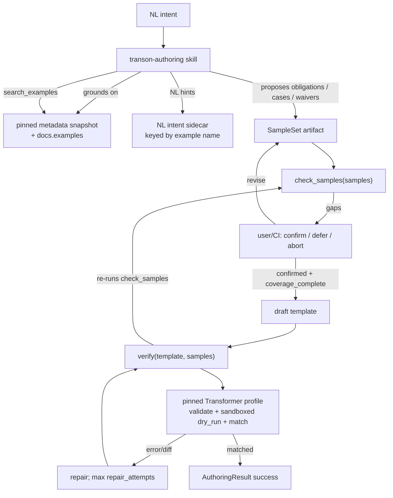

# SPEC — Transon Authoring Skill (`transon-authoring`)

A standalone, distributable capability that lets **coding agents and CI** in the org author
correct, engine-valid **Transon** JSON — grounded in engine-authoritative metadata, backed by a
**user-confirmed SampleSet**, and blessed by the engine at **`matched`** assurance before any
template is returned. It lives in its own repository, **beside** (not inside) the
`transon-blockly` editor and the `transon` engine.

> **Status:** Draft (pre-A0). This document is the contract for the project — behavior changes
> update this SPEC first, then code (see §12 governance).
>
> **Pre-A0 note:** Until A0 is approved/started, requirement and decision text may be rewritten in
> place to keep the draft coherent. **From A0 onward**, FR/NFR/AC/UC/AD/OQ IDs are append-only:
> never renumber; deprecate in place; new items take the next free number.

**Initial engine pin (A0 baseline):** `transon==0.1.7` with `metadata_version` `"3.0"`
(authoritative evidence: engine repo `pyproject.toml` version `0.1.7`;
`transon-blockly/docs/metadata-snapshot.json` records `engine_version` `0.1.7` and
`metadata_version` `3.0`). See AD-007 / §11.7.

---

## 0. Namespace & relationship to other repos

This is a **separate contract** from the editor's `docs/SPEC.md`. IDs here are independent of the
editor's numbering; the two documents are not cross-referenced by ID.

| Repo | Role | Bound by editor AD-008 (engine-free)? |
|---|---|---|
| `transon` (engine) | Owns `get_editor_metadata()`; executes templates; **authoritative** | n/a |
| `transon-blockly` (editor) | Visual editor; engine-free; consumes authored JSON via its import codec | yes |
| **`transon-authoring` (this repo)** | Authoring capability for AI agents; **may embed the engine** | **no** — see AD-002 |

The product name is **`transon-authoring`**. Any earlier editor-dev harness skill of the same name
is temporary and is removed or redirected once this package ships (A4+).

Architecture decisions live in **§6**. If the SPEC grows too large, extract `ARCHITECTURE.md`; if
that grows too large, split ADs into `docs/adr/`. Do not create empty ADR files up front.

---

## 1. Problem & motivation

Coding agents (Claude Code, Cursor) and CI bots are increasingly asked to produce Transon
templates. Left alone they **hallucinate Transon syntax** because authority is the **running pinned
engine + engine SPECIFICATION + pinned metadata export**, not model memory, generative web docs, or
Context7.

Static validation is also insufficient without a **confirmed SampleSet** whose cases satisfy
**declared coverage obligations**. This project: ground in metadata, craft/confirm samples, then
`verify` to **`matched`**.

---

## 2. Goals

- **G1** — From NL intent → sample loop (propose obligations → cases/waivers → user/CI confirm) →
  engine-valid JSON that `verify` blesses at **`assurance: "matched"`**. Editor "in-surface" is
  **not** part of the output contract (AD-013), subject to the v1 execution profile (AD-017).
- **G2** — Ground generation in the **pinned** metadata snapshot (and engine docs examples), not
  training data. “Current” means **current relative to the pin** (§11.7), not “latest on PyPI.”
- **G3** — **Verify before return**: never return a template unless `verify` yields `matched`.
- **G4** — Single-source skill + Claude Code and Cursor adapters + parity gate.
- **G5** — Decoupled from the editor; editor is an optional JSON sink.

## 3. Non-goals

- Not an in-editor chatbot / `AssistantProvider`.
- Not a new DSL, path syntax, or expression language.
- Not a Transon runtime (authors templates; engine executes).
- Not a workflow / no-code platform.
- Not bound by editor engine-free AD-008 (see AD-002).
- Not MCP, hosted HTTP engine, or WASM/Pyodide in v1.
- Not shell-less product/docs agents in v1.
- Not editor in-surface checking/disclosure.
- Not real filesystem/network I/O in `verify` dry-run (including inside timeout worker subprocesses).
- Not custom `Transformer` subclasses, custom rule/operator/function registries, or non-default
  markers as a **verify execution profile** in v1 (AD-017) — templates always run under `"$"`.

## 4. Consumers

| Consumer | Environment | Reach |
|---|---|---|
| Coding agent (Claude Code, Cursor) | shell | `python -m transon_authoring …` |
| CI / migration bot | headless shell | same; pre-confirmed SampleSet fixtures |
| `transon-blockly` | browser | optional sink via import codec |

---

## 5. Architecture



**Runtime (AD-006):** Python library is the contract; agents/CI use `python -m transon_authoring`.
No console-script product; no MCP.

---

## 6. Architecture decisions

- **AD-001 — Skill package.** Standalone repo/package (`SKILL.md` + resources + library).
- **AD-002 — Engine-dependent.** May/must embed the engine; does not inherit editor AD-008.
- **AD-003 — Engine is authority.** See AD-018 for precedence among engine, SPECIFICATION, snapshot.
- **AD-004 — Verify-before-return.** Success only if `verify` → `ok: true`, `assurance: "matched"`.
  `verify` **re-validates** the SampleSet via `check_samples` and rejects unless
  `ok_for_verify` (AD-019). Structured failure otherwise (§11.5).
- **AD-005 — Single-source, multi-tool.** One `SKILL.md`; Claude + Cursor adapters; parity gate.
- **AD-006 — Library-first; module entry.** APIs: `get_metadata`, `search_examples`,
  `check_samples`, `verify` (+ debug `validate` / `dry_run`). Invoked via
  `python -m transon_authoring` (§11.6).
- **AD-007 — Pin + drift + upgrade.** Depend on **`transon==0.1.7`** initially. Bundle
  `get_editor_metadata()` snapshot with provenance (`engine_version`, `metadata_version`, content
  hash, sync date). **Drift gate** compares the bundle to metadata produced by the **pinned**
  install — it does **not** detect newer PyPI releases. **Staleness/upgrade:** a scheduled or
  manual check against PyPI/latest engine opens a pin-bump PR; humans run `sync-metadata`, update
  `pyproject.toml` pin, refresh NL sidecar as needed, and merge deliberately (OQ-004 still applies
  for automation shape).
- **AD-008 — Ordinary JSON output.** No IR/DSL; no verifier-owned key-order canonicalization.
- **AD-009 — Convention-first install.** Native Claude/Cursor paths (§11.9); no MCP.
- **AD-010 — Eval-driven improvement.** Changes gated by NFR-010 / AD-020.
- **AD-011 — Measurement before skill body.** A2 before A3.
- **AD-012 — Pinned engine package; local execution only.** Verification depends on the pinned
  `transon` **Python package** loaded in the same environment — no hosted HTTP, WASM/Pyodide, or
  MCP. Dry-run cases MAY run in a **short-lived local worker subprocess** that imports that same
  package (AD-017 timeout isolation). That is still local/embedded execution, not a remote engine.
- **AD-013 — Engine-valid under v1 profile; no editor-surface awareness.** Output may be any
  template valid for the **v1 execution profile** (AD-017), not “any conceivable engine subclass.”
  No in-surface check/disclosure.
- **AD-014 — Samples before draft.** No draft until `coverage_complete` and user/CI confirmation
  are both true (separate flags — AD-016). CI uses pre-confirmed fixtures.
- **AD-015 — Sandboxed `file` / `include`.** In-memory write capture + explicit `includes` map;
  forbid real FS/network in dry-run. Expected writes live on sample cases.
- **AD-016 — Obligations in SampleSet; deterministic `check_samples`.** Model proposes coverage
  obligations; user/CI accepts/rejects them and confirms the SampleSet. `check_samples` only
  checks the artifact — it never parses NL. **`coverage_complete` ≠ `confirmed`.**
- **AD-017 — v1 execution profile (how verify executes).** `verify` / dry-run **always construct**
  `transon.Transformer` with:
  - the base class only (never a subclass);
  - built-in rule/operator/function registries as shipped in the pinned package;
  - default marker `"$"` (`Transformer.DEFAULT_MARKER`);
  - `max_include_depth=50` (engine default);
  - sandboxed `file_writer` + `template_loader` (AD-015);
  - the engine’s R-32 **one core recursion frame per template node** (pinned `0.1.7`; over-depth
    surfaces as include `TransformationError`, never raw `RecursionError`);
  - per-case wall-clock timeout **5s**, enforced by running each dry-run case in a **local worker
    subprocess** that imports the pinned package, applies the same sandbox delegates, and returns
    `{result, writes, errors}` over IPC. On timeout the worker is killed → `TimeoutError`,
    `failed_stage: "dry_run"`. Subprocess isolation does not change match semantics (NFR-002): same
    SampleSet + template + pin ⇒ same Verdict. Sandbox invariants (AD-015) hold inside the worker
    (no FS/network). The library/CLI **MUST NOT** expose knobs for non-default marker, transformer
    class, or registries in v1; explicit requests for those are rejected with `ProfileError` before
    any engine call (AC-027). Trust boundary: trusted local agents/CI only.
- **AD-018 — Authority precedence.** (1) behavior of the **pinned running engine**;
  (2) engine `docs/SPECIFICATION.md` for that version; (3) pinned `get_editor_metadata()` snapshot
  for catalog/examples structure; (4) NL intent sidecar (hints only). Never LLM memory / web /
  Context7 for Transon semantics (NFR-001).
- **AD-019 — `verify` re-checks SampleSet.** No unforgeable token. `verify` runs `check_samples`
  on the provided SampleSet and requires `ok_for_verify` before validate/dry_run/match.
- **AD-020 — Eval runner policy (resolves OQ-009).** See §11.8. Committed `evals/runner.json`
  pins provider/model/settings; 3 runs/fixture majority-of-3; population = all committed fixtures;
  ratchet and privacy rules normative.
- **AD-021 — Synthetic eval corpus from `docs.examples`; small-model primary gate (resolves
  OQ-024; absorbs RFC-001).** The pinned snapshot's flat `docs.examples` corpus (121 templates at
  `transon==0.1.7`) is an allowed **fixture factory** for the FR-017 improvement loop:
  any example MAY seed exactly one EvalFixture (v1 commits only the FR-029 tagged subset of
  ~25–30 selected seeds; later waves may extend toward all 121). A seeded fixture's SampleSet
  outputs come **only** from executing the
  seed template under the pinned engine's AD-017 profile (never model memory, never the snapshot
  `result` taken on faith — the corpus pair is re-executed). The **seed template is
  provenance-only**: committed under `evals/seeds/` (FR-029), never placed in the fixture object,
  the eval prompt, or the tools path of the skill under test; scoring stays behavioral
  (`assurance: "matched"` against the fixture SampleSet, §11.8), never seed-template recovery.
  Synthetic `intent_nl` is LLM-drafted (grounded on the example `doc` and, when present, the
  NL sidecar entry) but **human-accepted before commit** — never auto-committed. The primary
  NFR-010 gate model is a **small model** (pin: `claude-haiku-4-5-20251001`), so `SKILL.md` is
  driven to work without a frontier model; the gate-model swap and any later gate-model change
  are explicit eval-policy commits per §11.8. Synthetic SampleSets are **evals/CI fixtures
  only** — they never substitute for user confirmation in interactive authoring (AD-014/AD-016
  untouched).

---

## 7. Functional requirements

### Authoring core
- **FR-001** — Given NL intent and a SampleSet with `coverage_complete` and `confirmed`, draft
  candidate JSON grounded in the pinned snapshot (AD-018).
- **FR-002** — Authoring is driven by a **SampleSet** (§11.1): cases, obligations, waivers,
  optional `includes`, confirmation. Required for success.
- **FR-003** — Model-facing operations: `get_metadata`, `search_examples`, `check_samples`,
  `verify` via library / `python -m`. Debug `validate` / `dry_run` are not blessing paths.

### Sample loop
- **FR-020** — `check_samples(samples: SampleSet) -> SampleCheck` (§11.1). Deterministic.
  Returns separate `coverage_complete` and `confirmed` (and `ok_for_verify`).
- **FR-021** — Persist SampleSet with `schema_version` `"1.0"` and all fields in §11.1.
- **FR-022** — Repo config `.transon-authoring.json` (§11.9). First **interactive** use without
  config asks layout; CI/non-interactive never asks.
- **FR-023** — Exits: **confirm** / **defer** / **abort** (§11.5). Sample conversation unbounded
  until one exit; no auto-confirm.
- **FR-024** — Present gaps with proposed waivers/assumptions; user accepts/rejects; persist
  structured waivers that clear obligation ids.
- **FR-025** — Skill proposes `coverage` obligations inside the SampleSet from NL (never as a
  separate free-form inference step inside the library).

### Verification
- **FR-004** — After SampleSet preflight, run engine `validate`.
- **FR-005** — Sandboxed dry-run per case; match via §11.4 (including optional `writes`).
- **FR-006** — Stages: `samples` → `validate` → `dry_run` → `match` only (no engine round-trip).
- **FR-007** — On verify failure, feed verbatim engine errors/diff; repair up to
  **`repair_attempts`** times. **Counting:** `repair_attempts` = max number of **repair** cycles
  after a failed `verify` (default **3**, allowed range **1..10** in `.transon-authoring.json`).
  Total candidates tried ≤ `1 + repair_attempts`. This bound is a **skill-loop** concern: the
  library/`python -m … verify` subcommand performs a **single** deterministic `verify` (NFR-002 /
  AC-018) and does **not** loop or accept `--repair-attempts`. The skill reads `repair_attempts`
  from ProjectConfig when deciding whether to draft another candidate.
- **FR-008** — On exhaustion / defer / abort / reject, return `AuthoringResult` failure (§11.5).
  Never return unverified JSON as success.

### Grounding & corpus
- **FR-009** — Bundle pinned `get_editor_metadata()` snapshot as the structural grounding catalog.
- **FR-010** — **Authoritative example JSON** is `docs.examples` inside that snapshot (flat corpus:
  `{name, doc, template, data, result, tags}` per engine metadata_version 3.0 / editor
  metadata-contract §2.7). **Do not duplicate** those payloads from the editor codec corpus.
  Freshly authored **NL intents** live in `resources/nl-intents.json` (or `.jsonl`) as
  `{ "schema_version": "1.0", "intents": { "<example-name>": { "nl": string, "notes?": string } } }`
  keyed by stable example `name`. `search_examples` retrieves by NL/sidecar + tags/name over the
  snapshot examples. Provenance for the snapshot covers examples; sidecar has its own content hash
  in provenance. **No editor-only corpus entries in v1.** (Revises OQ-003.)
- **FR-011** — `sync-metadata` regenerates snapshot from the pinned engine and records provenance.

### Distribution
- **FR-012** — Canonical `SKILL.md` + Claude/Cursor adapters.
- **FR-013** — **Deprecated (pre-A0; no implementation).** MCP server removed from v1 (§3). Kept
  only so the ID is not reused after A0 lock.
- **FR-014** — `python -m transon_authoring` module entry with subcommands in §11.6.

### Installation
- **FR-015** — Install procedures (§11.9): Claude personal/project skill paths; Cursor
  `.cursor/skills/transon-authoring/`. Pin skill + engine versions in adapter metadata/comments.
- **FR-016** — Idempotent install; uninstall removes **only** files this installer created
  (manifest recorded at install time).

### Improvement
- **FR-017** — Eval-driven loop (AD-010/020).
- **FR-018** — Capture failing cases into evals only after **privacy redaction** and **explicit
  consent** (§11.8). No raw secrets/PII committed.
- **FR-029** — **Synthetic fixture generator + seed provenance + regen gate (AD-021).** A
  maintainer script (`scripts/` — not shipped in the package) mints EvalFixtures from snapshot
  `docs.examples` seeds: deterministic (no wall-clock/randomness), **3–6 cases per fixture**
  chosen by which §11.1 coverage kinds apply to the seed's input shape (happy path always;
  `list_empty`/`list_singleton`/`list_many` for array inputs; `optional_present`/`optional_absent`
  for optional keys; a `NO_CONTENT`-relevant case where the seed's rule can produce it and a
  `writes` case for writes-capable seeds — these last two are emitted as `kind: "custom"`
  obligations whose `description` names the behavior and whose `target` is omitted); **case 1 is
  always the example's own `data`/`result` pair re-executed through the pinned engine**;
  remaining cases are synthetic inputs run the same way. **Budget rule:** every case — including
  ones satisfying `kind: "custom"` obligations — counts toward the 6-case cap; one case MAY
  satisfy several obligations, and the generator prefers packing obligations into existing cases
  over adding cases. If distinct cases would still exceed six, applicable kinds are dropped
  (their obligations not emitted) in this fixed order until the budget fits:
  `list_singleton`, then `optional_present`, then `list_many`; happy path, `list_empty`,
  `optional_absent`, and the `NO_CONTENT`/`writes` custom kinds are never dropped (at most six
  of those can apply, so the cap is always satisfiable). If the applicable kinds yield fewer
  than three distinct cases (e.g. a scalar seed with no arrays, optional keys, `NO_CONTENT`
  relevance, or writes), the generator pads to the 3-case minimum with **value-variation
  cases**: the corpus `data` shape with each leaf scalar replaced by a deterministic alternate
  from a fixed per-JSON-type substitution table (position-indexed, no randomness), outputs
  obtained from the pinned engine as usual, each emitted as a `kind: "custom"` obligation whose
  `description` names it a value variation. Generated confirmations use
  `confirmed: true`, `confirmed_by: "ci"`, no `confirmed_at` (determinism), and the fingerprint
  from the OQ-015 acquisition path. Fixtures are committed under `evals/cases/` **without any
  seed-template field**; provenance is committed at `evals/seeds/<fixture-id>.json` as
  `{ "source_example": string, "template": <Transon JSON>, "generator": { "version": string,
  "notes"?: string } }`. `check_evals --lint` verifies, for every fixture with a seed file:
  (a) **snapshot provenance** — `source_example` names an entry in the pinned snapshot's
  `docs.examples`, the seed `template` JSON-equals that entry's `template`, and case 1's `input`
  JSON-equals that entry's `data` (so a seed cannot smuggle in a template that never originated
  from the corpus, per AD-021); and (b) **regeneration** — the fixture **regenerates
  bit-identically** (§11.1 SampleSet content subset and `content_fingerprint`) from its seed
  under the current pin (AC-030) — the same drift discipline as `check_snapshot`. v1 scope: a tagged
  subset (~25–30 seeds, one per tag family) with the remainder as follow-up waves; the
  should-refuse bucket stays hand-authored (no synthesized refuse intents in v1).
  *(rev 2026-07-12, OQ-025)* The applicability predicates — which corpus keys are **optional**,
  which arrays receive the `list_*` kinds, when a `NO_CONTENT` case is **relevant**, what makes a
  seed **writes-capable**, how `SampleSet.includes` is populated, and seed **eligibility** (the
  corpus-pair re-execution assert; never-dropped obligations exceeding the six-case budget) — are
  fixed in OQ-025.

### Install CI
- **FR-019** — CI install checks:
  - **Claude Code:** structural install at documented path; plus headless listing **if** OQ-010
    resolves positively — until then claim **install integrity**, not “discoverability.”
  - **Cursor:** structural adapter install + `python -m transon_authoring metadata` runtime smoke.
    Do **not** claim Cursor “discovered/ingested” the skill (OQ-008).

### Additional
- **FR-026** — Library and module entry emit/accept only the JSON schemas in §11. Malformed JSON or
  unknown/`unsupported` `schema_version` on ingress → CLI exit **2** and a `schema-error` envelope
  (§11.6); skill-level `AuthoringResult.status === "schema-error"` (§11.5).
- **FR-027** — `verify` must call `check_samples` and require `ok_for_verify` (AD-019).
- **FR-028** — Enforce AD-017 resource limits (timeout, include depth) during dry-run.

---

## 8. Non-functional requirements

- **NFR-001 — Authority isolation.** Transon semantics only from AD-018 sources. Context7 only for
  host-tooling APIs.
- **NFR-002 — Deterministic gates.** Same SampleSet + template + pin ⇒ same `SampleCheck` /
  `Verdict`. Sandboxed I/O only.
- **NFR-003 — Offline after install.** No network required for verify/check/metadata once the
  pinned engine and package are installed (local package import and optional local worker
  subprocesses only).
- **NFR-004 — Snapshot drift vs pin.** `check_snapshot` fails if bundle ≠ metadata from pinned
  `transon==…`. Does not track unpinned newer releases (AD-007).
- **NFR-005 — Honest failure.** §11.5 statuses distinguishable from success.
- **NFR-006 — Bounded repair.** Per FR-007; sample loop unbounded until confirm/defer/abort.
- **NFR-007 — Adapter parity.** Claude/Cursor equal capability or documented exclusion.
- **NFR-008 — Versioned releases.** Record skill version, engine pin, snapshot hash.
- **NFR-009 — Install integrity.** FR-015/016/019; wording is **install integrity + runtime
  smoke**, not host “discoverability,” except where OQ-010 enables a Claude listing check.
- **NFR-010 — Eval regression gate.** Targets (OQ-006): authoring ≥80%→95% ratchet; adversarial
  refuse-class =100%. Exact formula and runner: §11.8 / AD-020.
- **NFR-011 — Privacy.** Real-use fixtures require redaction + consent before commit (FR-018).

---

## 9. Acceptance criteria & use cases

### Acceptance criteria
- **AC-001** — Confirmed complete SampleSet for “flatten each order's line items with the customer
  name” → success `AuthoringResult` with `verdict.assurance === "matched"`.
- **AC-002** — Mode/variant intent → correct engine mode and `matched`.
- **AC-003** — Nonexistent operator/mode with `expect: "refuse"` → no invented name; failure
  envelope; adversarial gate 100%.
- **AC-004** — Without `ok_for_verify` SampleSet → no template; status ∈
  `need-samples`|`deferred`|`aborted`|`samples-rejected`.
- **AC-005** — Claude/Cursor adapters share one `SKILL.md` and same module recipe.
- **AC-006** — Pin/metadata change without sync → drift gate red until `sync-metadata`.
- **AC-007** — Clean install/uninstall idempotent on supported platforms (§11.9).
- **AC-008** — Eval rate below target or fixture regression → gate red (NFR-010).
- **AC-009** — CI: Cursor structural install + module smoke; Claude structural install (listing
  only if OQ-010 allows). No false “discoverability” claims.
- **AC-010** — Unmet obligations → gap codes; skill presents waivers; user accepts/rejects.
- **AC-011** — *(rev 2026-07-11, OQ-023 split — conversational half, A3)* Conversational confirm
  (skill body) writes `confirmation` and binds `content_fingerprint` via the OQ-015 acquisition
  path. The schema-testable half is AC-029.
- **AC-012** — Defer → `deferred`; abort → `aborted`; no template.
- **AC-013** — Success ⇒ `verdict.ok && assurance === "matched"` only.
- **AC-014** — CI fixtures with `confirmed` + `coverage_complete`; no layout prompt when config
  present or `--samples` given.
- **AC-015** — Dry-run: no real FS/network; writes captured; includes from map only.
- **AC-016** — Zero cases, malformed SampleSet, `coverage_complete=false`, or unconfirmed →
  `verify` fails at `samples` stage; never `matched`.
- **AC-017** — `coverage_complete` and `confirmed` are independent; both required for
  `ok_for_verify`.
- **AC-018** — Same inputs ⇒ identical `SampleCheck`/`Verdict` semantic content (NFR-002) under
  §11.4/§11.0 equality (object key order insignificant).
- **AC-019** — After `repair_attempts` failed repairs, status `repair-exhausted`; no further tries.
- **AC-020** — With network disabled post-install, `metadata`/`check-samples`/`verify` still work
  (NFR-003).
- **AC-021** — Module subcommands conform to §11.6 (exit codes, stdout JSON envelope).
- **AC-022** — `search_examples` returns snapshot `docs.examples` hits; NL sidecar enriches
  display only.
- **AC-023** — Root engine `NO_CONTENT` does not deep-equal JSON `null` (§11.4).
- **AC-024** — Captured `writes` matched when case declares `writes`; undeclared non-empty writes
  fail match.
- **AC-025** — Eval fixtures from real use lack secrets/PII; consent recorded (NFR-011).
- **AC-026** — Failure envelopes always include `ok: false` and a §11.5 `status`.
- **AC-027** — `verify` always executes under the AD-017 default profile (base `Transformer`,
  marker `"$"`, built-in registries). Explicit profile-violating requests (reserved CLI flags /
  config fields for non-default marker or transformer class) are rejected with `ProfileError`
  before engine execution; skill-level stop uses `status: "profile-rejected"` (§11.5). A template
  JSON that merely *would* need another marker is **not** detectable as a profile violation — it
  runs under `"$"` and fails or succeeds via normal validate/dry_run/match.
- **AC-028** — Per-case dry-run exceeding 5s fails `dry_run` with timeout error.
- **AC-029** — *(OQ-023 split — schema half, A2)* Persisting a SampleSet per FR-021/§11.1 and
  setting `confirmation` with `confirmed: true`, a valid `confirmed_by`, and the
  `content_fingerprint` obtained via the OQ-015 acquisition path yields `check_samples` →
  `confirmed: true`; any subsequent edit to the hashed content subset flips it back via
  `fingerprint_mismatch`.
- **AC-030** — *(FR-029 regen gate)* `check_evals --lint` is **red** when any committed fixture
  with a matching `evals/seeds/<fixture-id>.json` does not regenerate bit-identically (SampleSet
  content subset and `content_fingerprint`) from its seed under the current pin; when a seed
  file has no matching fixture; or when a seed fails FR-029 snapshot provenance
  (`source_example` absent from the pinned `docs.examples`, seed `template` ≠ that entry's
  `template`, or case 1 `input` ≠ that entry's `data`). A repo whose seeds, fixtures, and
  snapshot agree lints **green**.

### Use cases
- **UC-001** — Claude Code: samples → confirm → author → `verify` → PR with template + SampleSet.
- **UC-002** — Cursor same path; optional handoff to blockly import (no in-surface guarantee).
- **UC-003** — CI batch with pre-confirmed SampleSets + committed config; non-interactive.
- **UC-004** — New engineer installs adapters, first-run layout prompt, authors successfully.

---

## 10. Package layout

```
transon-authoring/
├── SKILL.md
├── pyproject.toml                 # depends on transon==0.1.7 (initial pin)
├── src/transon_authoring/
│   ├── __main__.py                # §11.6
│   ├── verify.py
│   ├── samples.py
│   ├── metadata.py
│   ├── examples.py
│   ├── match.py                   # §11.4
│   └── schemas/                   # SampleSet, SampleCheck, Verdict, AuthoringResult, EvalFixture, …
├── resources/
│   ├── metadata-snapshot.json     # get_editor_metadata() pin
│   ├── metadata-snapshot.md       # provenance
│   └── nl-intents.json            # NL sidecar by example name (FR-010)
├── adapters/claude/ … cursor/
├── install/claude.py cursor.py
├── scripts/sync_metadata.py check_snapshot.py check_parity.py check_evals.py check_install.py
│                                  # + eval_harness.py (OQ-017 tool loop, driven by check_evals)
├── evals/
│   ├── runner.json                # AD-020 pin
│   ├── targets.json               # NFR-010 rates (OQ-016e)
│   ├── baseline.json              # fixture-regression record (OQ-016f)
│   ├── cases/
│   └── seeds/                     # synthetic-fixture provenance (AD-021 / FR-029)
└── docs/
    ├── SPEC.md
    └── traceability.md            # generated or maintained matrix (§17)
```

Repo-root `resources/` is the canonical, human-edited source. The wheel build maps it into the
package as `transon_authoring/resources/` (hatchling force-include) so the installed package
satisfies NFR-003 / the §11.6 `metadata` subcommand offline; the library loads the snapshot via
`importlib.resources` with a repo-root fallback for source checkouts.

---

## 11. Normative contracts

### 11.0 Common types & serialization

```
JsonValue = null | boolean | number | string | JsonValue[] | { [key: string]: JsonValue }

# Tagged values allowed ONLY in SampleCase.output and SampleCase.writes values:
NoContentRef = { "$transon_authoring": "NO_CONTENT" }
LitRef = { "$transon_authoring": "lit", "value": JsonValue }

AuthoringTag =
  | NoContentRef                          # means engine NO_CONTENT sentinel
  | LitRef                                # means the literal JsonValue in "value"
```

**Decoding (normative):** When reading an expected `output` / `writes` value:

1. If it is an object with exactly the keys required for a known tag:
   - `NoContentRef` → compare as engine `NO_CONTENT`;
   - `LitRef` → compare as deep-equal to `value` (use this when the literal data is itself
     `{"$transon_authoring": "NO_CONTENT"}` or any other tagged shape).
2. If it is an object containing `"$transon_authoring"` but is **not** a known tag → SampleSet
   schema failure, gap `schema_invalid` (message: unknown authoring tag).
3. Otherwise treat as ordinary `JsonValue` (including objects that happen to use other keys).

Tagged forms MUST NOT appear inside **templates** or **include** map templates (those are plain
Transon JSON; the library does not reject such keys at ingress — a template object using
`"$transon_authoring"` is ordinary data to the engine and is faithfully re-encoded on output).
AuthoringTags appear in exactly two places (rev 2026-07-11, OQ-012):

1. **SampleSet expectation values** (`output`, `writes` values), decoded per the rules above.
   **Decoding applies recursively at every nesting level** of an expected value.
2. **Library output positions** that echo raw engine values — the `dry-run` envelope `result` and
   `writes` values, and `DiffEntry.actual` — produced by the **engine-value encoding**
   (normative):

```
enc(v):
  engine NO_CONTENT sentinel                     -> NoContentRef
  array                                          -> [ enc(x) for x in v ]
  object containing the key "$transon_authoring" -> { "$transon_authoring": "lit",
                                                      "value": { k: enc(v[k]) … } }
  other object                                   -> { k: enc(v[k]) … }
  scalar                                         -> v
```

`enc` is injective: in encoded output a bare `NoContentRef` node always denotes the engine
sentinel, and a `LitRef` node always wraps literal data. If a raw engine value is not
JSON-representable (non-string object key, non-finite number, or a non-JSON Python type), the
affected dry-run case fails with a stable library-text `EngineError`
(`type: "TransformationError"`, `engine_type` omitted).

**Serialization (stdout):** UTF-8 JSON objects; `json.dumps` with `allow_nan=False`,
`separators=(",", ":")` optional for compactness in CI, pretty-print allowed for humans; **object
key order is not significant** for equality of results; parsers MUST reject duplicate object keys
and non-finite numbers (`NaN`/`Infinity`) at ingress.

**Schema versions:** documents carry `schema_version` string. v1 library understands `"1.0"` for
SampleSet, SampleCheck, Verdict, AuthoringResult, CliError, ProjectConfig, NlIntents, EvalRunner,
EvalFixture.

### 11.1 SampleSet & `check_samples`

```
CoverageObligation = {
  id: string,                       # stable within SampleSet
  kind: "happy_path" | "optional_present" | "optional_absent"
      | "list_empty" | "list_singleton" | "list_many" | "mode_choice" | "custom",
  target?: string,                  # JSON pointer (kinds that need structural checks) or
                                    # mode label string for mode_choice; see §11.1 table
  description: string,
  acceptance: "proposed" | "accepted" | "rejected"
}

Waiver = {
  id: string,
  clears_obligation_ids: string[],  # must reference coverage[].id
  reason: string,
  acceptance: "proposed" | "accepted" | "rejected"
}

SampleCase = {
  id: string,
  input: JsonValue,
  output: JsonValue | AuthoringTag,
  writes?: { [name: string]: JsonValue | AuthoringTag },
  satisfies: string[]               # obligation ids this case is claimed to satisfy
}

Confirmation = {
  confirmed: boolean,
  confirmed_by?: "user" | "ci",
  confirmed_at?: string,            # ISO-8601
  note?: string,
  content_fingerprint: string       # hex sha256 over canonical subset (sorted keys):
                                    # schema_version, coverage, waivers, cases, includes
                                    # intent_nl is DELIBERATELY EXCLUDED: it is human context only
                                    # and must not invalidate confirmation when prose is edited
                                    # canonicalization + acquisition path per OQ-015: obtained
                                    # from SampleCheck.content_fingerprint, never hand-computed;
                                    # pre-confirmation placeholder is "" (OQ-018a)
}

SampleSet = {
  schema_version: "1.0",
  intent_nl?: string,
  coverage: CoverageObligation[],
  cases: SampleCase[],
  waivers: Waiver[],
  includes?: { [name: string]: JsonValue },  # include name → template JSON
  confirmation: Confirmation
}

Gap = {
  code: GapCode,
  message: string,
  obligation_id?: string,
  case_id?: string
}

GapCode =
  | "schema_invalid"
  | "missing_happy_path"
  | "optional_present_unmet"
  | "optional_absent_unmet"
  | "list_empty_unmet"
  | "list_singleton_unmet"
  | "list_many_unmet"
  | "mode_choice_unmet"
  | "custom_unmet"
  | "obligation_not_accepted"
  | "waiver_invalid"
  | "unconfirmed"
  | "fingerprint_mismatch"
  | "no_cases"
  | "case_satisfies_unknown"
  | "duplicate_id"
  | "target_invalid"
  | "target_required"
```

```
SampleCheck = {
  schema_version: "1.0",
  coverage_complete: boolean,
  confirmed: boolean,
  ok_for_verify: boolean,
  gaps: Gap[],
  content_fingerprint: string
}
```

**`check_samples` algorithm (normative):**

1. Validate SampleSet against JSON Schema `1.0` (including AuthoringTag decoding rules in §11.0 —
   the §11.0 rule-2 unknown-tag check is procedural in this step, not part of the bundled JSON
   Schema, and reports as a `schema_invalid` **gap** on an otherwise schema-valid document).
   On failure: all flags false; gap `schema_invalid`.
2. Reject duplicate `coverage.id` / `cases.id` / `waivers.id` → `duplicate_id`.
3. Consider only obligations with `acceptance === "accepted"`. If any remain `proposed`,
   gap `obligation_not_accepted` and `coverage_complete=false`. Rejected obligations are ignored.
4. For each accepted obligation, it is **met** if an **accepted** waiver lists its `id` in
   `clears_obligation_ids` (waiver refs must be valid else `waiver_invalid`), **or** some case
   lists its `id` in `satisfies` **and** the kind-specific rule below holds. Unknown ids in
   `satisfies` → `case_satisfies_unknown` (does not meet any obligation).

   **JSON pointer `target`:** when a kind requires a pointer, `target` MUST be a JSON pointer
   string starting with `/` (RFC 6901). Missing/invalid pointer → `target_required` or
   `target_invalid`; obligation unmet. Resolve against that case’s `input` only.

   | kind | `target` | Structural check on a satisfying case’s `input` |
   |---|---|---|
   | `happy_path` | ignored | None beyond schema: case exists with `input` + `output`. A `satisfies` claim alone meets it. |
   | `optional_present` | required pointer | Pointer resolves to a value **and** the final key/index exists (not missing). `null` counts as present. |
   | `optional_absent` | required pointer | Pointer does **not** resolve (missing key/index). Present `null` does **not** count as absent. |
   | `list_empty` | required pointer | Pointer resolves to an array of length `0`. |
   | `list_singleton` | required pointer | Pointer resolves to an array of length `1`. |
   | `list_many` | required pointer | Pointer resolves to an array of length `≥ 2`. |
   | `mode_choice` | optional string (mode/variant label; **not** a pointer) | **No input structural check** — mode is a property of the template under draft, not of sample inputs. Met by an accepted `satisfies` claim on any case (user/CI attestation) or an accepted waiver. |
   | `custom` | optional | **No input structural check.** Met by `satisfies` claim or waiver; `description` is human-only. |

5. `coverage_complete = (no unmet accepted obligations) && (cases.length >= 1)`. If
   `cases.length === 0` → gap `no_cases`.
6. `confirmed = confirmation.confirmed === true
   && confirmation.content_fingerprint === recomputed_fingerprint
   && confirmed_by in {"user","ci"}`. Else gaps `unconfirmed` / `fingerprint_mismatch`.
7. `ok_for_verify = coverage_complete && confirmed && gaps has no schema/duplicate errors`.

All steps are deterministic given the SampleSet alone (NFR-002).

**Gap order (normative, OQ-013):** `gaps[]` is emitted in algorithm-step order: (1)
`schema_invalid`, sorted by (JSON instance path, message); (2) `duplicate_id`, in document order
`coverage` → `cases` → `waivers`; (3) obligation gaps in `coverage[]` document order — within one
obligation `obligation_not_accepted`, then `target_required` / `target_invalid`, then its
`*_unmet` code; (4) `waiver_invalid` in `waivers[]` order; (5) `case_satisfies_unknown` in
`cases[]` order; (6) `no_cases`; (7) `unconfirmed`, then `fingerprint_mismatch`.

**Edge semantics (OQ-018, normative):** (a) pre-confirmation `content_fingerprint` placeholder is
`""`; (b) `fingerprint_mismatch` is emitted alongside `unconfirmed` whenever the recorded
fingerprint differs from the recomputed one, even when `confirmed === false`; (c)
`confirmed: true` with missing/invalid `confirmed_by` → gap `unconfirmed` (message names
`confirmed_by`); (d) a waiver referencing a **rejected** obligation is not `waiver_invalid` — the
clear has no effect; (e) `proposed`/`rejected` waivers never clear and emit no gap; dangling
references are `waiver_invalid` regardless of the waiver's acceptance, and remaining valid refs
of an accepted waiver still clear; (f) `target` on `happy_path`/`mode_choice`/`custom` is
ignored, never validated; (g) an invalid `includes` template fails at the `dry_run` stage
(include-load error on the including case), never at `samples`.

**Skill responsibilities:** propose obligations (`acceptance: "proposed"`); propose cases/waivers;
present gaps; on user approval set obligations/waivers to `accepted` and set `confirmation` with
fresh fingerprint (obtained per the OQ-015 acquisition path). Library never sets
`confirmed: true`.

### 11.2 `verify`

```
EngineError = {
  type: "DefinitionError" | "TransformationError" | "ProfileError" | "TimeoutError" | "PreflightError",
                            # taxonomy bucket; non-engine exceptions leaked by the pinned
                            # engine during dry-run map to "TransformationError" (OQ-014)
  message: string,          # verbatim engine str(exc) when from engine; stable library text otherwise
  engine_type?: string,     # actual Python exception class name when an exception was caught
  path?: string,
  case_id?: string          # SampleCase.id when the error is attributable to one dry-run
                            # case; absent for validate/preflight/profile errors (OQ-011)
}

DiffEntry = {
  path: string,             # JSON pointer
  kind: "missing" | "extra" | "value_mismatch" | "type_mismatch" | "writes_mismatch",
  expected?: JsonValue | AuthoringTag | { "writes": { [name: string]: JsonValue | AuthoringTag } },
  actual?: JsonValue | AuthoringTag | { "writes": { [name: string]: JsonValue | AuthoringTag } },
  case_id: string           # SampleCase.id of the mismatching case (OQ-011)
}

Verdict = {
  schema_version: "1.0",
  ok: boolean,
  assurance?: "matched",
  failed_stage?: "samples" | "validate" | "dry_run" | "match",
  errors: EngineError[],
  gaps?: Gap[],             # when failed_stage === "samples"
  json?: JsonValue,         # candidate on success
  diff?: DiffEntry[],
  writes?: { [name: string]: JsonValue | AuthoringTag }
                            # reserved; never emitted by verify in v1 (OQ-011)
}
```

**Stages:**

1. **`samples`** — parse SampleSet; run `check_samples`; require `ok_for_verify`. Else
   `failed_stage: "samples"` (malformed handled as CLI schema-error per §11.6; semantic rejects
   include zero cases, incomplete coverage, unconfirmed, fingerprint mismatch).
2. **`validate`** — construct `Transformer(candidate)` **only** with AD-017 defaults; call
   `validate()`. There is no JSON-level “custom marker” detector. `ProfileError` occurs only when
   the caller requested a non-default profile via rejected API/CLI/config knobs (AC-027).
   An exception raised by construction/`validate()` that is **not** `DefinitionError` (the pinned
   engine leaks e.g. `TypeError` for `{"$": 5}`) is reported like the dry-run leak closure
   (OQ-014c) but in the “template invalid” class: `type: "DefinitionError"`, `engine_type` = the
   actual Python exception class name, `message` = verbatim `str(exc)`,
   `failed_stage: "validate"` (rev 2026-07-11).
3. **`dry_run`** — per case, execute in a **worker subprocess** (AD-017) with
   `transform(input, no_content=Transformer.NO_CONTENT)`, sandboxed delegates, timeout 5s,
   `max_include_depth=50`, `includes` from SampleSet only. Cases execute **sequentially in
   `cases[]` document order**; every case runs even after earlier failures; each failing case
   contributes exactly one `EngineError` carrying its `case_id`. If any case fails,
   `failed_stage: "dry_run"` and `match` is not entered; results of passing cases are not
   included in the `Verdict` (OQ-011).
4. **`match`** — §11.4 comparing outputs and writes (AuthoringTag decoding on expected values).
   All cases are compared; every `DiffEntry` carries `case_id`; entries are grouped by case in
   `cases[]` order. `match` produces no `EngineError`s — a match failure is expressed by `diff`
   alone (OQ-011).

`ok === true` iff all stages pass; then `assurance` is always `"matched"`.

**Array order (normative, OQ-013):** `errors[]`: one element for `validate` failures; one per
failing case in `cases[]` document order for `dry_run`. `diff[]`: cases in `cases[]` order;
within a case, output entries precede the writes entry.

**Diff construction (normative, OQ-013):** output diffs come from a recursive walk of
`dec(expected)` vs `enc(actual)` (§11.0): when both nodes are objects, visit the union of keys in
Unicode code-point ascending order — a key present only in expected emits `missing`, only in
actual emits `extra`, present in both recurses; when both are arrays, visit indices ascending —
pairwise recursion, an index beyond the shorter side emits `missing`/`extra`; when node types
differ (`NoContentRef` counts as its own type; `int` and `float` are distinct types), emit
`type_mismatch` with both snapshots; same-type scalars that differ emit `value_mismatch`. An
emitted entry terminates recursion at that node. `path` is the RFC 6901 JSON pointer within the
case’s **encoded** output document (§11.0; inside a `LitRef` wrapper the pointer traverses
`/value/…` segments of the encoded form) (root = `""`). Writes mismatches emit exactly one entry
per case:
`kind: "writes_mismatch"`, `path: ""`, `expected: {"writes": dec(case.writes ?? {})}`,
`actual: {"writes": {name: enc(content)…}}`.

### 11.3 Execution profile details (AD-017 / AD-015)

| Concern | v1 rule |
|---|---|
| Transformer | Always construct `transon.Transformer` (base class) |
| Marker | Always `"$"` |
| Registries | built-ins from pinned package only |
| `include` | loader resolves `SampleSet.includes[name]` only; miss → dry_run error |
| `file` | capture `(name, content)` in memory; never FS |
| Custom rules/ops/fns | out of scope |
| Include depth | engine `max_include_depth=50` |
| Recursion budget (R-32) | one core frame per template node (pinned `0.1.7`); self-`include` reach ≥75 at CPython default recursion limit; over-depth → include `TransformationError`, never raw `RecursionError` |
| Timeout | 5s wall clock per case via **local worker subprocess** |
| Profile overrides | none; reserved knobs → `ProfileError` / exit 2 |
| Trust | trusted local agent/CI only |

### 11.4 Matching (§5 / FR-005)

Matching compares `dec(expected)` against `enc(actual)` over a common encoded domain (OQ-012):
`dec` maps `NoContentRef` to itself, `LitRef(value)` to `enc(value)` (literal data contains no
sentinel), recurses into plain arrays/objects, and rejects unknown tags per §11.0 rule 2. Rules
1–8 below are the observable consequences and remain normative.

**Deep equality** on JSON values (and `NoContentRef`):

1. **NO_CONTENT:** Decode expected via §11.0. If actual is the engine `NO_CONTENT` sentinel, it
   matches only expected `NoContentRef`. It does **not** match `null`, `false`, `0`, or `""`.
   Expected `LitRef` whose `value` is the NoContentRef object matches only that literal JSON
   object from the engine result (not the sentinel).
2. **null:** matches only `null`.
3. **boolean:** matches same boolean (not numbers).
4. **number:** type-sensitive: Python `int` matches only `int` with equal value; `float` only
   `float`. `1` ≠ `1.0`. Non-finite forbidden at parse.
5. **string:** exact code-point equality.
6. **array:** same length; pairwise equal in order.
7. **object:** same key set (order ignored); each key’s values equal.
8. **writes:** Let `W` be captured map (names → content; encode engine `NO_CONTENT` content as
   `NoContentRef` when returning writes). Decode expected `writes` values per §11.0. If case has
   `writes`: deep-equal `W` to decoded expectations (missing keys / extras → `writes_mismatch`).
   If case omits `writes`: require `W` empty; else fail match.

### 11.5 AuthoringResult & failure taxonomy

**Producer:** `AuthoringResult` is the **skill-level** envelope assembled by the agent following
`SKILL.md`. **No** `python -m transon_authoring` subcommand emits it — the module returns
`SampleCheck` / `Verdict` / debug objects only (§11.6). The skill maps those plus conversation
exits into `AuthoringResult`.

**Conformance:** JSON Schema at `src/transon_authoring/schemas/authoring_result.json` (and related
schemas). Verified by (1) unit tests that validate fixtures against the schema, and (2) authoring
eval fixtures that assert the skill’s final message/object conforms to `AuthoringResult`
(`expect` outcomes in §11.8).

```
AuthoringResult = {
  schema_version: "1.0",
  ok: boolean,
  status: "matched"
       | "need-samples" | "deferred" | "aborted"
       | "repair-exhausted" | "samples-rejected" | "verify-failed"
       | "schema-error" | "profile-rejected",
  explanation: string,
  template?: JsonValue,           # only when ok
  verdict?: Verdict,
  sample_check?: SampleCheck,
  gaps?: Gap[],
  last_candidate?: JsonValue,
  samples_path?: string,
  repair_count?: number           # repairs consumed by the skill loop
}
```

| status | When |
|---|---|
| `matched` | skill returns a template with `verdict.ok` and `assurance === "matched"` |
| `need-samples` | stopped with incomplete coverage / need more cases |
| `deferred` | user chose defer |
| `aborted` | user chose abort, **or the skill aborted after determining the request cannot be grounded in the pinned metadata (refusal — AC-003; rev 2026-07-11, OQ-016b)** |
| `repair-exhausted` | skill consumed all `repair_attempts` without a matched verdict |
| `samples-rejected` | `check_samples` / verify `samples` stage failed on a schema-valid SampleSet |
| `verify-failed` | validate, dry_run, or match failed and the skill stopped without scheduling another repair |
| `schema-error` | malformed JSON or unsupported `schema_version` on ingress |
| `profile-rejected` | user/agent requested an out-of-profile execution option (non-default marker/class); skill stops without calling verify — or CLI rejected the reserved knob (AC-027) |

### 11.6 Module CLI (`python -m transon_authoring`)

**Global:** stdout = one JSON value (result envelope); stderr = human diagnostics only; never put
primary machine result on stderr.

| Subcommand | Inputs | stdout | exit |
|---|---|---|---|
| `metadata` | none | snapshot JSON (`JsonValue`) | 0 |
| `examples search <query>` | query string [`--limit N`, default 10 (OQ-022)] | `{ "schema_version": "1.0", "hits": [ example objects… ] }` | 0 |
| `check-samples` | `--samples PATH` | `SampleCheck` on schema-valid input | 0 if `ok_for_verify` else 1 |
| `verify` | `--template PATH --samples PATH` | `Verdict` on schema-valid inputs | 0 if ok else 1 |
| `validate` | `--template PATH` | `{ "schema_version": "1.0", ok, errors }` debug | 0/1 |
| `dry-run` | `--template PATH --input PATH` [`--includes PATH`] | `{ "schema_version": "1.0", ok, result?, writes?, errors }` | 0/1 |
| `init-config` | `--layout sibling\|central\|custom` [`--pattern STR`] [`--samples-dir STR`] [`--repair-attempts N`] [`--non-interactive`] [`--force`] (rev 2026-07-11: flags aligned with §11.9) | `ProjectConfig` | 0/2 |

**Exit codes:** `0` success; `1` semantic check/verify failure on **schema-valid** inputs; `2`
usage / **schema** / config error; `3` internal unexpected error — emits the `CliError`
`internal-error` envelope on stdout (best effort, single write; traceback on stderr only)
(OQ-014).

**Envelope notes (OQ-014):** on `dry-run` success `result` and `writes` are both present (values
per §11.0 `enc`; `writes` may be `{}`); on failure both are omitted and `errors` is non-empty.
The `metadata` subcommand is exempt from `schema_version`: it emits the pinned snapshot document
verbatim (an engine document with its own `metadata_version`), not a library envelope.
`--includes PATH` is a bare JSON object of the `SampleSet.includes` shape (include name →
template JSON), no `schema_version` wrapper; any other JSON value → exit 2 `schema-error`.

**Schema vs semantic failures (FR-026):** If `--samples` or `--template` (or `--input` /
`--includes`) cannot be parsed as JSON, fails SampleSet/template schema validation, or carries an
unsupported `schema_version`:

- exit **`2`**
- stdout: a `CliError` with `status: "schema-error"` and `errors` of `type: "PreflightError"`
  (not a `SampleCheck` / `Verdict` body)

```
CliError = {
  schema_version: "1.0",
  ok: false,
  status: "schema-error" | "profile-rejected" | "internal-error",
  explanation: string,
  errors: EngineError[]      # may be empty for "internal-error"
}
```

`"internal-error"` is CLI-level only and is **not** an `AuthoringResult.status` value (OQ-014).

**`PreflightError` (OQ-014):** the `EngineError.type` for ingress failures detected before any
engine construction — JSON parse failure, duplicate object keys or non-finite numbers (§11.0
ingress), JSON-Schema validation failure, unsupported `schema_version`, unreadable input file.
Message is stable library text; `engine_type` omitted; it appears only in `CliError` envelopes
with `status: "schema-error"` (exit 2). An exception raised during dry-run execution that is
neither `DefinitionError` nor `TransformationError` (the pinned engine leaks e.g. `ValueError`
from `call int`, `ZeroDivisionError` from `expr /`) is reported as
`type: "TransformationError"` — the engine SPECIFICATION §2.4 class “template valid, data
incompatible” — with `engine_type` = the actual Python exception class name and `message` =
verbatim `str(exc)`.

**JSON Schema draft (OQ-014):** all documents under `src/transon_authoring/schemas/` are authored
in **draft 2020-12** (each declares `$schema`); runtime validation uses the `jsonschema` Python
package (runtime dependency `jsonschema>=4.18`); `schema_invalid` gap / `PreflightError`
messages derive from validator errors sorted by (JSON instance path, message) for determinism
(OQ-013). Because message text originates in `jsonschema`, NFR-002's byte-determinism for these
messages is scoped to a **fixed environment** (same `jsonschema` version); cross-version message
drift is possible and acceptable (rev 2026-07-11).

If the SampleSet is schema-valid but `ok_for_verify` is false, `check-samples` exits **`1`** with a
normal `SampleCheck`. If schema-valid but verify stages fail, `verify` exits **`1`** with a normal
`Verdict` (`failed_stage` set).

**Exit-2 boundary (rev 2026-07-11):** exit 2 covers failures of the **bundled JSON Schema** (plus
parse/version/read failures). The procedural §11.0 rule-2 unknown-AuthoringTag check is a
`schema_invalid` **gap** on a schema-valid document — reported in a normal `SampleCheck` /
`Verdict` with exit **1**, not a `CliError`.

**No repair loop on CLI:** `verify` runs once. There is **no** `--repair-attempts` flag (FR-007).

**Reserved profile knobs:** flags such as `--marker` / `--transformer` are rejected (exit **2**,
`CliError` with `status: "profile-rejected"` and a single `ProfileError`) even if present for
forward-compat parsing.

**Engine errors:** `EngineError.message` is the **exact** `str(exception)` from the engine when
applicable; wrapped in the JSON envelope above (never paraphrased in `message`).

### 11.7 Pin, drift, upgrade

- **A0 pin:** `transon==0.1.7`, expect `metadata_version == "3.0"`,
  `engine_version == "0.1.7"` in snapshot.
- **“Current metadata”** = metadata from that pin after `sync-metadata`, bundled in-repo.
- **Drift:** bundle hash/content vs live `get_editor_metadata()` under the pinned install. Drift
  also covers the NL sidecar: `check_snapshot` enforces the OQ-021 consistency rules (sidecar
  keys ⊆ snapshot example names; provenance sidecar hash current).
- **Newer releases:** not red by drift alone. Upgrade path: bump pin → sync → update NL sidecar →
  PR. Optional scheduled notifier (OQ-004) opens that PR.

### 11.8 Evals (AD-020; resolves OQ-009)

`evals/runner.json`:
```
{
  "schema_version": "1.0",
  "provider": string,
  "model_id": string,
  "max_output_tokens": integer,
  "tool_budget": integer,
  "runs_per_fixture": 3,
  "pass_rule": "majority",
  "seed": number | null
}
```
Initial committed values are chosen at A2 standup and become part of the gate identity; changing
them is an explicit eval-policy commit. *(rev 2026-07-12: `temperature` removed from the shape —
the pinned `claude-sonnet-5` rejects non-default sampling parameters with a 400; the harness
never sends sampling parameters, and determinism steering lives in the prompt.)*

*(rev 2026-07-12, AD-021 / OQ-024)* **Gate model policy:** the primary NFR-010 gate model is a
**small model**; the normative pin — effective from the §14-ordered eval-policy commit that
swaps `runner.json`, until which the A2-standup values remain in force — is
`provider: "anthropic"`, `model_id: "claude-haiku-4-5-20251001"` (the harness still sends no
sampling parameters). A commit that
changes the gate `model_id` (including this swap from the A2-standup `claude-sonnet-5`) is an
eval-policy commit that **MUST in the same commit** reset `evals/baseline.json` to
`{ "schema_version": "1.0", "passing": [] }` — majority results under one model are not
transferable to another, so no fixture is "previously passing" under a model that never ran it;
the baseline repopulates via `check_evals --update-baseline` on the next green run.
`evals/targets.json` is **not** reset: `authoring_target` keeps its current ratchet value (0.80
floor at swap time), and an expected sub-target rate after a gate-model swap surfaces as a red
gate to fix by improving `SKILL.md`, never by lowering targets.

**EvalFixture** (`evals/cases/*.json`, schema_version `"1.0"`):
```
EvalFixture = {
  schema_version: "1.0",
  id: string,
  expect: "matched" | "refuse" | "matched_correction",
  intent_nl: string,
  samples?: SampleSet,              # required for expect matched / matched_correction when
                                    # the fixture supplies the SampleSet rather than driving the
                                    # full sample loop
  notes?: string,
  consent?: {                       # required when sourced from real use (NFR-011)
    by: string,
    at: string,                     # ISO-8601
    note: string
  },
  redacted: boolean                 # true if privacy redaction applied
}
```

- **Population:** all committed fixtures under `evals/cases/`.
- **Buckets / denominators:**
  - **should-succeed (authoring rate):** fixtures with `expect: "matched"`.
  - **should-refuse (adversarial 100%):** fixtures with `expect: "refuse"`.
  - **correction (reported, not in either rate above):** fixtures with
    `expect: "matched_correction"` — skill may map a nonexistent name to a real metadata
    operator/mode and still `matched`; tracked separately for diagnostics; neither raises nor
    lowers the refuse invariant.
- **Infra:** `infra_error` runs excluded from denominators but reported; if infra skips &gt; 10% of
  fixtures in a bucket → gate **fail** for that gate.
- **Authoring pass rate:** `#should-succeed fixtures with majority matched / #scored should-succeed`.
- **Adversarial refuse rate:** `#refuse fixtures with majority refuse-success / #scored refuse`
  must be **100%** (no invented operators/modes).
- **Ratchet:** let `T` be declared authoring target (starts 0.80). After release R with achieved
  rate `A`, set `T' = max(T, min(A, 0.95))` by explicit commit to `evals/targets.json`. Never
  decrease `T` silently.
- **`evals/targets.json` (OQ-016e):** `{ "schema_version": "1.0", "authoring_target": number,
  "adversarial_target": 1.0 }` — initial `authoring_target` 0.80; `adversarial_target` constant.
- **Fixture regression:** any previously passing captured fixture (any expect bucket) that fails
  majority → gate fail regardless of aggregate rate. The normative record of "previously
  passing" is the committed `evals/baseline.json` (OQ-016f):
  `{ "schema_version": "1.0", "passing": [fixture ids…] }`; ids are added only by explicit
  `check_evals --update-baseline` commits.
- **Harness (OQ-017):** raw provider-API tool loop in `scripts/eval_harness.py`, driven by
  `scripts/check_evals.py`; system prompt = repo-root `SKILL.md` verbatim + fixed preamble; tools
  `write_file` / `transon_authoring` / `submit_result` only; per-episode temp workspace;
  provider client behind the optional extra `transon-authoring[evals]`; full runs live in a
  credential-holding dispatch workflow, per-PR CI runs `check_evals --lint` + fake-provider unit
  tests.
- **Privacy (NFR-011):** before committing a real-use failure: strip secrets/PII; set
  `redacted: true`; record `consent`; default deny.
- **Synthetic fixtures (AD-021 / FR-029):** fixtures minted from snapshot `docs.examples` are
  ordinary EvalFixtures — same schema, same buckets, same scoring; they carry no `consent`
  (nothing real-use) and `redacted: false`. Their SampleSet outputs come only from the pinned
  engine under the AD-017 profile; the seed template lives at `evals/seeds/<fixture-id>.json`
  (shape in FR-029) and is **never** part of the fixture object, the harness prompt, or the
  episode workspace. `check_evals --lint` enforces seed↔fixture bit-identical regeneration
  (AC-030). Synthetic `intent_nl` is LLM-drafted, human-accepted before commit (AD-021).

### 11.9 Project config & installation

**`.transon-authoring.json`:**
```
ProjectConfig = {
  schema_version: "1.0",
  layout: "sibling" | "central" | "custom",
  # sibling: "<templateStem>.samples.json" beside template
  # central: "transon-samples/<stem>.samples.json"
  # custom: pattern with placeholders
  pattern?: string,           # required iff layout=custom
  repair_attempts: number,    # default 3, range 1..10
  samples_dir?: string        # for central; default "transon-samples"
}
```

**Placeholders (custom only):** `{stem}` (template file stem), `{dir}` (template directory).
Forbidden: `{..}`, absolute FS escapes, env interpolation. After expansion, path MUST resolve
inside the repo root (no `..` escape).

**Collisions:** `init-config` refuses to overwrite unless `--force`. Sample file write refuses
overwrite unless user/CI confirms or `--force`.

**Write location (rev 2026-07-11):** `init-config` writes `.transon-authoring.json` to the
**current working directory** (the skill runs `init-config` at the repo root) and emits the
`ProjectConfig` document on stdout. Interactive prompting (layout only) happens only when stdin
is a TTY and `--non-interactive` is absent; `check-samples`/`verify` never read config and never
prompt.

**Non-interactive:** `--non-interactive` requires all fields on CLI or existing config; else exit 2.

**Install destinations (POSIX; Windows uses equivalent user profile paths):**

| Tool | Project scope | Personal scope |
|---|---|---|
| Claude Code | `<repo>/.claude/skills/transon-authoring/` | `~/.claude/skills/transon-authoring/` |
| Cursor | `<repo>/.cursor/skills/transon-authoring/` | n/a (project-only in v1) |

Strategy: **copy** adapter files (not symlink) for hermeticity. Record
`.install-manifest.json` listing owned paths + versions. **Upgrade:** re-run install (idempotent
replace of owned files). **Uninstall:** delete only manifest paths.

Supported platforms for install scripts: macOS and Linux (Windows best-effort; not a v1 gate).

---

## 12. Governance

- SPEC-first; ID lock at A0 start.
- Maker ≠ checker on library/snapshot/adapters/evals.
- Single-source adapters (NFR-007).
- Measurement before skill body (AD-011).
- Traceability matrix (§17) updated in the same change as FR/NFR/AC edits after A0.

---

## 13. Testing & gates

| Gate | Enforces |
|---|---|
| Unit tests (library) | §11 schemas, match, sandbox, preflight |
| `check_snapshot` | NFR-004 / AD-007 |
| `check_evals` | NFR-010 / AD-020; its `--lint` mode carries the NFR-011 fixture lint (AC-025) and the FR-029 seed-regen check (AC-030) |
| `check_parity` | NFR-007 / AC-005 |
| `check_install` | NFR-009 / FR-019 (integrity + smoke) |
| Authoring evals | should-succeed → matched |
| Adversarial evals | expect refuse =100% |
| Sandbox evals | AC-015/023/024/028 |

---

## 14. Milestones

- **A0 — Grounding spine.** Repo, package skeleton, pin `transon==0.1.7`, snapshot + provenance +
  drift gate, NL-intents sidecar skeleton, `SKILL.md` stub, §17 matrix stub. *Resolve at start:*
  **OQ-019** (Python floor, needed for `pyproject.toml`), **OQ-021** (sidecar consistency gate),
  **OQ-022** (`search_examples` minimal contract) — each resolved by a SPEC edit before the
  corresponding artifact lands. *DoD:* `python -m transon_authoring metadata` works offline
  against pin; `check_snapshot` green (including OQ-021 sidecar check); no open decisions
  required to start A1. **ID lock on A0 approval.**
- **A1 — Verification library.** Full §11.2–11.6 verify/match/sandbox/CLI (single-shot verify; no
  repair flag); SampleSet schema validation; worker-subprocess timeout; AuthoringTag encoding.
  *Resolve during design, before implementation of the affected part:* **OQ-011** (per-case
  attribution + reporting policy), **OQ-012** (`NO_CONTENT` encoding outside expectations),
  **OQ-013** (deterministic array ordering — prerequisite for AC-018 fixtures), **OQ-014**
  (envelope closure). *DoD:* OQ-011–OQ-014 closed in SPEC; AC-015/016/018/021/023/024/027/028
  green on fixtures (AC-027 = default-profile execution + rejection of reserved profile knobs —
  not “detect custom marker in template JSON”); hand AC-001 path with fixed SampleSet (no skill
  body).
- **A2 — Measurement spine.** `check_samples` complete; config init; `evals/runner.json` +
  targets + seed cases; `check_evals` red/green; trivial skill stub only. *Resolve at standup,
  before the corresponding code:* **OQ-015** (fingerprint canonicalization + acquisition path —
  before `check_samples`), **OQ-016** (eval bucket scoring) and **OQ-017** (eval harness shape) —
  both before `check_evals`; **OQ-018** (`check_samples` edge semantics) and **OQ-023** (AC-011
  traceability split, jointly with A3). *DoD:* OQ-015–OQ-018 closed in SPEC; AD-020 executable;
  NFR-010 gate runs; AD-011 satisfied; A3 unblocked.
- **A3 — Authoring loop.** Full skill body; repair counting per FR-007; §11.5 statuses; plus the
  AD-021/FR-029 improvement-loop deliverables (rev 2026-07-12): synthetic-fixture generator +
  `evals/seeds/` provenance + AC-030 regen lint; the v1 fixture wave (~25–30 human-accepted
  synthetic fixtures); the §11.8 eval-policy commit swapping `evals/runner.json` to the
  small-model pin with the baseline reset. *Entry:* OQ-023 resolved (A2/A3 boundary for AC-011).
  *DoD:* FR-029 landed (AC-030 green); **authoring target met under the small-model pin**
  (`claude-haiku-4-5-20251001`) on the corpus including the v1 synthetic wave;
  AC-003/004/010–014/017/019/025/026 green.
- **A4 — Distribution.** Adapters, install/uninstall, parity, install integrity CI; resolve
  OQ-010 and **OQ-020** (Python package distribution channel). *DoD:* AC-005/007/009.
- **A5 — Editor sink + release.** UC-002 demo; versioned release notes with pin.

*Improvement-loop note (AD-021 / FR-029, rev 2026-07-12):* synthetic corpus growth and the
small-model gate swap are **A3 deliverables** (folded into the A3 DoD above) — the harness they
rely on is the A2 deliverable, and the work proceeds in parallel with the skill body. Ordering
within A3: SPEC (this edit) → generator + seeds + regen lint (FR-029) → v1 fixture wave with
human-accepted intents → the eval-policy commit that swaps `evals/runner.json` to the small
model and resets `evals/baseline.json` (§11.8) → iterate `SKILL.md` until the authoring target
is met under that pin. Later fixture waves beyond the v1 subset remain ongoing improvement-loop
work and do not gate any milestone.

---

## 15. Open questions

- **OQ-001** — **Resolved (2026-07-09; rev 2026-07-10):** pinned local engine package only; no
  HTTP/WASM/MCP. Dry-run may use local worker subprocesses for timeout (AD-012/017).
- **OQ-002** — **Resolved (2026-07-09):** standalone repo (AD-001).
- **OQ-003** — **Resolved (2026-07-09; rev 2026-07-10):** authoritative example JSON =
  snapshot `docs.examples`; NL intents in sidecar by `name`; no editor codec corpus duplication
  (FR-010).
- **OQ-004** — **Resolved (2026-07-09):** manual sync + drift now; scheduled PR bot later.
- **OQ-005** — **Resolved (2026-07-09; rev 2026-07-10):** no in-surface gate/disclosure (AD-013).
- **OQ-006** — **Resolved (2026-07-09):** authoring ≥80%→95%; adversarial refuse =100%.
- **OQ-007** — **Resolved (2026-07-09; rev 2026-07-10):** plain skill then plugin; no MCP.
- **OQ-008** — **Resolved (2026-07-10):** Cursor = structural + runtime smoke; no ingest claim.
- **OQ-009** — **Resolved (2026-07-10):** Eval runner normative in AD-020 / §11.8.
- **OQ-010** — *(open; A4 only)* Claude Code headless skill listing. Until resolved, CI asserts
  **install integrity** only for Claude (FR-019 / AC-009). Does **not** block A0–A3.
- **OQ-011** — **Resolved (2026-07-11):** Per-case attribution: `EngineError` gains optional
  `case_id` (present when the error is attributable to a single `SampleCase`; absent for
  `validate`, preflight, and profile errors); `DiffEntry` gains **required** `case_id`.
  Reporting policy: stages stay fail-fast **between** stages; **within** `dry_run` and `match`
  every case is processed sequentially in `cases[]` document order and **every** failure is
  reported — one `EngineError` per failing dry-run case, all `DiffEntry`s per mismatching case.
  This maximizes verbatim-error yield per repair round (FR-007) at bounded cost (≤ 5 s × case
  count). Root-level `Verdict.writes` is **never emitted** in v1 (a single map is unattributable
  across cases; per-case writes are visible via the `dry-run` debug verb); the field stays in the
  schema as optional/reserved. §11.2 amended.
- **OQ-012** — **Resolved (2026-07-11):** Library outputs echo raw engine values through the
  normative **engine-value encoding `enc`** added to §11.0: the `NO_CONTENT` sentinel encodes as
  `NoContentRef`; arrays/objects encode recursively; any object containing the key
  `"$transon_authoring"` is wrapped as `LitRef` (member values encoded); scalars pass through.
  `enc` is injective, so in encoded output a bare `NoContentRef` always denotes the sentinel and
  never literal data. Applies to the `dry-run` envelope `result` and `writes` values and to
  `DiffEntry.actual` (root `Verdict.writes` is not emitted — OQ-011). §11.0's "SampleSet
  expectation encoding only" sentence is replaced, and expected-value decoding is clarified to
  apply **recursively at every nesting level** (nested sentinels are reachable in pinned-engine
  results: plain list/dict template nodes pass `NO_CONTENT` through). Engine values that are not
  JSON-representable (non-string object keys — reachable via `map` key mode; non-finite
  numbers — reachable via `call float`; non-JSON Python types) fail that case at `dry_run` with a
  stable library-text `EngineError`; such values are equally inexpressible as expectations, so
  nothing representable is lost. §11.4 matching is defined over the encoded domain (equivalent to
  raw-domain matching by injectivity).
- **OQ-013** — **Resolved (2026-07-11):** No order-insensitivity carve-out. `gaps[]`, `errors[]`,
  and `diff[]` get a **defined emission order** (document-order primary; §11.1/§11.2 amended),
  and AC-018 equality is plain structural equality — arrays ordered, object key order
  insignificant (§11.0). Orders: **gaps** follow the §11.1 algorithm steps (see §11.1 "Gap
  order"); **errors**: `validate` emits exactly one; `dry_run` emits one per failing case in
  `cases[]` order; preflight/profile envelopes carry a single error; **diff**: cases in `cases[]`
  order; within a case, output entries first (deterministic recursive walk defined in §11.2),
  then the single `writes_mismatch` entry if any.
- **OQ-014** — **Resolved (2026-07-11):**
  (a) **Exit 3** emits a best-effort `CliError` envelope on stdout —
  `{"schema_version":"1.0","ok":false,"status":"internal-error","explanation":"<ExceptionClass>: <message>","errors":[]}` —
  as a single write, with the traceback on stderr only. The CLI error envelope is formalized as
  the **`CliError`** document, `status ∈ {"schema-error","profile-rejected","internal-error"}`,
  added to the §11.0 schema-version list; `"internal-error"` is CLI-level only and is **not**
  added to `AuthoringResult.status`.
  (b) **`schema_version` on all envelopes:** `examples search` →
  `{"schema_version":"1.0","hits":[…]}`; `validate` → `{"schema_version":"1.0","ok":…,"errors":[…]}`;
  `dry-run` → `{"schema_version":"1.0","ok":…,"result"?,"writes"?,"errors":[…]}` — on success
  `result` and `writes` are both present (values per §11.0 `enc`; `writes` may be `{}`), on
  failure both omitted and `errors` non-empty. The `metadata` subcommand is exempt: it emits the
  pinned snapshot document verbatim (an engine document with its own `metadata_version`), not a
  library envelope.
  (c) **`PreflightError` kept and defined:** the `EngineError.type` for ingress failures detected
  before any engine construction — JSON parse failure, duplicate object keys or non-finite
  numbers (§11.0 ingress), JSON-Schema validation failure, unsupported `schema_version`,
  unreadable input file. Message is stable library text; `engine_type` omitted; it appears only
  in `CliError` envelopes with `status:"schema-error"` (exit 2). `ProfileError` remains the type
  for reserved-knob rejection (`status:"profile-rejected"`, exit 2). **`EngineError.type`
  closure:** an exception raised during dry-run execution that is neither `DefinitionError` nor
  `TransformationError` (the pinned engine leaks e.g. `ValueError` from `call int`,
  `ZeroDivisionError` from `expr /`) is reported as `type:"TransformationError"` — the engine
  SPECIFICATION §2.4 class "template valid, data incompatible" — with `engine_type` = the actual
  Python exception class name and `message` = verbatim `str(exc)`.
  (d) **`--includes` file schema:** exactly the `SampleSet.includes` map shape — a bare JSON
  object `{ [name: string]: JsonValue }` (include name → template JSON), no `schema_version`
  wrapper; any other JSON value → exit 2 `schema-error`.
  (e) **JSON Schema draft:** all documents under `src/transon_authoring/schemas/` are authored in
  **draft 2020-12** (each declares `$schema`); runtime validation uses the `jsonschema` Python
  package (new runtime dependency, `jsonschema>=4.18`); `schema_invalid`
  gap/`PreflightError` messages derive from validator errors sorted by (JSON instance path,
  message) for determinism (OQ-013).
- **OQ-015** — **Resolved (2026-07-11, A2 standup):** The A1 provisional canonicalization is
  adopted **unchanged** as normative (committed fixtures need no regeneration).
  `content_fingerprint` = lowercase hex SHA-256 of the UTF-8 encoding of
  `json.dumps(subset, sort_keys=True, separators=(",", ":"), ensure_ascii=False, allow_nan=False)`,
  where `subset` is the object containing exactly those of the keys `schema_version`, `coverage`,
  `waivers`, `cases`, `includes` that are **present** in the SampleSet document — an absent
  `includes` is omitted, **not** hashed as `{}`; `intent_nl` and `confirmation` stay excluded
  (§11.1). Number formatting follows the parsed document: integers serialize with no fraction
  part, floats by Python shortest-round-trip `repr` — consistent with §11.4 (`1` ≠ `1.0`);
  non-finite numbers are already rejected at ingress (§11.0). Non-ASCII is emitted unescaped and
  hashed as UTF-8. **Acquisition path (normative):** agents/skill NEVER compute or reimplement
  the fingerprint. They obtain it exclusively from `SampleCheck.content_fingerprint` by running
  `check-samples` on the not-yet-confirmed SampleSet (the exit-1 `SampleCheck` still carries the
  recomputed fingerprint) and copy that value into `confirmation.content_fingerprint` at
  confirmation time. `transon_authoring.samples.content_fingerprint` is the single
  implementation; its "provisional-internal" marker is removed.
- **OQ-016** — **Resolved (2026-07-11, A2 standup):** Mechanical scoring per run, over the final
  `AuthoringResult` submitted by the skill under test (§11.8 harness, OQ-017):
  (a) **matched-success** (for `expect: "matched"` **and** `expect: "matched_correction"`): the
  submitted `AuthoringResult` validates against the bundled schema, `ok === true`,
  `status === "matched"`, `template` present, `verdict.ok === true` with
  `assurance === "matched"`, **and** the harness independently re-runs
  `python -m transon_authoring verify --template <submitted> --samples <fixture SampleSet>` with
  exit 0 (the skill's claim is never trusted — AD-004).
  (b) **refuse-success** (for `expect: "refuse"`): the submitted `AuthoringResult` validates
  against the schema, `ok === false`, `template` absent, and `status` ∈ {`need-samples`,
  `deferred`, `aborted`, `samples-rejected`, `verify-failed`, `repair-exhausted`,
  `profile-rejected`}. `status: "schema-error"` and a missing/invalid submission are scored as
  refuse-**failure** (not infra). The §11.5 `aborted` row is reworded to include skill-initiated
  refusal (AC-003).
  (c) **`matched_correction` is reporting-only:** scored with rule (a); its pass rate is reported
  as a separate *correction rate* but gates nothing (per §11.8 buckets); its fixtures still
  participate in the fixture-regression rule.
  (d) **`infra_error`:** provider/API transport failure, harness fault, or provider-side
  refusal-to-serve — never model behavior; excluded from denominators per §11.8 with the 10% cap.
  (e) **`evals/targets.json` (normative shape; §11.8):** `{ "schema_version": "1.0",
  "authoring_target": number (initial 0.80), "adversarial_target": 1.0 }` — the ratchet edits
  `authoring_target` by explicit commit; `adversarial_target` is constant 1.0.
  (f) **Fixture-regression baseline (normative; §11.8):** committed `evals/baseline.json` —
  `{ "schema_version": "1.0", "passing": [fixture ids…] }`, the set of fixture ids that have
  achieved majority-pass in a previously accepted gate run. `check_evals` fails if any baseline
  id fails its majority, regardless of aggregate rates; ids are added only via explicit
  `check_evals --update-baseline` commits (append-only in practice; removals require deleting the
  fixture).
- **OQ-017** — **Resolved (2026-07-11, A2 standup):** The runner is a **raw API tool loop** owned
  by this repo (no headless coding-agent dependency, no MCP): `scripts/eval_harness.py`, driven
  by `scripts/check_evals.py`.
  (a) **Prompting:** the system prompt is the verbatim bytes of the repo-root `SKILL.md` plus a
  fixed harness preamble (workspace rules, tool descriptions, "finish by calling `submit_result`
  exactly once"). The user message carries the fixture's `intent_nl` and, when the fixture
  supplies `samples`, the workspace-relative path where the harness wrote it (`samples.json`).
  (b) **Tools (exactly three, provider tool-use API):** `write_file(path, content)` — write a
  UTF-8 file at a relative path confined to the per-run temp workspace;
  `transon_authoring(argv: string[])` — run `python -m transon_authoring <argv…>` with
  cwd = workspace, returning `{exit_code, stdout, stderr}` (stdout/stderr truncated at a fixed
  byte cap); `submit_result(result: AuthoringResult)` — ends the episode. No shell tool, no
  network tool, no absolute paths.
  (c) **Budget & pinning:** `evals/runner.json` (AD-020) pins provider/model/settings;
  `tool_budget` caps total tool calls per run — exceeding it, or ending without `submit_result`,
  scores the run as bucket-failure (not infra). No sampling parameters are sent (rev 2026-07-12:
  the pinned model rejects non-default `temperature`/`top_p`/`top_k` with a 400); `seed` passed
  through when the provider supports it.
  (d) **Provider client:** selected by `runner.json.provider`; v1 implements `"anthropic"` via
  the `anthropic` SDK, declared as the optional extra `transon-authoring[evals]` — never a
  runtime dependency (NFR-003 is unaffected: evals are inherently online and are not part of the
  offline surface).
  (e) **CI shape:** full `check_evals` runs in a separate manually-dispatched (and later
  scheduled) workflow holding the provider secret — never in per-PR CI. Per-PR CI runs the
  credential-free parts: `check_evals --lint` (fixture/runner/targets/baseline structural checks,
  NFR-011) and the scoring/harness unit tests, which use an injected fake provider
  (NFR-002-style determinism for the gate logic itself).
  (f) **Initial committed `runner.json` values (gate identity per AD-020):**
  `provider: "anthropic"`, `model_id: "claude-sonnet-5"`,
  `max_output_tokens: 8192`, `tool_budget: 32`, `runs_per_fixture: 3`,
  `pass_rule: "majority"`, `seed: null` (rev 2026-07-12: `temperature` pin dropped — see §11.8).
  Changing any is an explicit eval-policy commit. *(rev 2026-07-12, OQ-024/AD-021: the
  `model_id` above is the A2-standup **initial** value and is superseded by the §11.8 gate-model
  policy — `claude-haiku-4-5-20251001` becomes the pin effective from the ordered eval-policy
  commit that swaps `runner.json` and resets the baseline; until that commit lands, these
  committed values remain the in-force gate identity.)*
- **OQ-018** — **Resolved (2026-07-11, A2 standup):** all edges resolved to the A1-implemented
  behavior, now normative in §11.1 ("Edge semantics"):
  (a) **Placeholder:** `Confirmation.content_fingerprint` is required; the normative
  pre-confirmation placeholder is the empty string `""`.
  (b) `fingerprint_mismatch` **is** emitted alongside `unconfirmed` whenever the recorded
  fingerprint differs from the recomputed one, including when `confirmed === false`
  (deterministic; harmless because `confirmed` is already false). Order per §11.1 gap order:
  `unconfirmed` then `fingerprint_mismatch`.
  (c) `confirmed: true` with missing or invalid `confirmed_by` → gap **`unconfirmed`** (message
  names `confirmed_by`); no new gap code.
  (d) A waiver referencing a **rejected** obligation is **not** `waiver_invalid`: any
  `coverage[].id` is a valid reference; the clear simply has no effect (rejected obligations are
  ignored at step 3).
  (e) `proposed`/`rejected` waivers never clear obligations and emit no gap by themselves;
  `waiver_invalid` is per dangling reference (any acceptance), and the remaining valid refs of an
  **accepted** waiver still clear.
  (f) `target` on `happy_path` / `mode_choice` / `custom` is **ignored, never validated** —
  `target_required`/`target_invalid` apply only to the five pointer kinds; bundled-schema typing
  still applies.
  (g) An invalid template inside `includes` fails at **`dry_run`** stage (include-load error on
  the including case), never at `samples`: `check_samples` is engine-free and checks the artifact
  only (AD-016 / NFR-002); §11.1 step 1 validates `includes` values only as `JsonValue`s.
- **OQ-019** — **Resolved (2026-07-11):** Python floor is **`>=3.10`** in `pyproject.toml`. The
  pinned engine's actual marker is `>=3.9` (checked in the `transon==0.1.7` checkout), so any
  floor ≥3.9 is dependency-compatible; 3.10 is chosen because 3.9 is past end-of-life
  (Oct 2025) and the AGENTS.md stack contract already states ≥3.10. Note `tomllib` is 3.11+:
  repo scripts that read the pin from `pyproject.toml` must not import `tomllib` (parse the pin
  line textually).
- **OQ-020** — *(open; A4)* Distribution channel for the Python package itself (PyPI name
  `transon-authoring` vs private index). §11.9 covers skill-file install only; UC-004's install
  story depends on this. Does **not** block A0–A3.
- **OQ-021** — **Resolved (2026-07-11):** Sidecar consistency is part of `check_snapshot` (no
  separate gate). Normative checks: (a) `resources/nl-intents.json` parses, has
  `schema_version: "1.0"` and an `intents` object per FR-010; (b) every key of `intents` MUST be
  the `name` of an example in the bundled snapshot's `docs.examples` — any dangling key is a
  **failure** (gate red, exit 1, dangling names listed on stderr); (c) snapshot examples
  **without** a sidecar entry are **allowed** — the gate stays green but MUST report the count of
  uncovered examples on stderr (full sorted name list under `--verbose`), so a pin bump never
  *silently* strands missing entries; (d) the sidecar's SHA-256 recorded in the provenance file
  (FR-010) MUST match the current sidecar bytes — mismatch is a failure until `sync-metadata` is
  re-run.
- **OQ-022** — **Resolved (2026-07-11):** Minimal normative
  `search_examples(query: str, *, limit: int = 10) -> list` contract: (a) **exact-name
  guarantee** — if `query` equals an example `name` (case-sensitive), that example MUST be in the
  results, ranked first; (b) **bound** — at most `limit` results (`limit ≥ 1`; default 10);
  (c) **determinism** — results are a pure function of (query, snapshot, sidecar); ties and all
  ranking below the exact-name hit are ordered by the example's index in snapshot `docs.examples`
  (corpus order); (d) **payload** — each hit is the snapshot example object verbatim, plus an
  optional `"nl"` string copied from the sidecar when present; retrieval MAY match over `name`,
  `tags`, `doc`, and sidecar NL text (FR-010), but hit *content* other than `nl` comes only from
  the snapshot (this is what AC-022's "sidecar enriches display only" means). Ranking beyond
  (a)–(c) is unspecified.
- **OQ-023** — **Resolved (2026-07-11, A2 standup):** AC-011 is split. New **AC-029** (schema
  half, A2, FR-021): persisting a SampleSet per FR-021/§11.1 and setting `confirmation` with
  `confirmed: true`, a valid `confirmed_by`, and the `content_fingerprint` obtained via the
  OQ-015 acquisition path yields `check_samples` → `confirmed: true`; any subsequent edit to the
  hashed content subset flips it back via `fingerprint_mismatch`. **AC-011** is reworded to the
  conversational half only ("conversational confirm (skill body) writes `confirmation` and binds
  `content_fingerprint` via the OQ-015 acquisition path") and remains mapped to FR-024 at A3.
  §17: FR-021 row → `AC-029, AC-017`; FR-024 row unchanged (`AC-010, AC-011`).
- **OQ-024** — **Resolved (2026-07-12; absorbs RFC-001,
  `docs/proposals/rfc-001-synthetic-eval-corpus-for-small-models.md`):** synthetic eval corpus
  from `docs.examples` and small-model primary gate. Author decisions, normative in AD-021 /
  FR-029 / §11.8:
  (a) **gate model** — `claude-haiku-4-5-20251001` replaces `claude-sonnet-5` as the NFR-010
  pin (dated ID, same provider, no harness change);
  (b) **stratification budget** — 3–6 cases per fixture, driven by which §11.1 coverage kinds
  apply to the seed's input shape, not a flat count;
  (c) **v1 scope** — a tagged subset of ~25–30 seeds (one per tag family), remainder as
  follow-up waves; all-121 coverage is not a v1 requirement;
  (d) **corpus pair** — every fixture's case 1 is the example's own `data`/`result` re-executed
  through the pinned engine; corpus-only single-case fixtures are forbidden (leakage);
  (e) **refuse bucket** — hand-authored seeds only in v1; no synthesized refuse intents (near-miss
  fakes risk colliding with legitimate `matched_correction` mapping);
  (f) **provenance/regen** — seeds at `evals/seeds/<fixture-id>.json`
  (`{source_example, template, generator:{version, notes?}}`); `check_evals --lint` proves
  bit-identical regeneration under the current pin (AC-030);
  (g) **baseline on gate-model swap** — `evals/baseline.json` resets to an empty `passing` list
  in the same eval-policy commit; `authoring_target` stays 0.80 (ratchet untouched at its floor).
- **OQ-025** — **Resolved (2026-07-12, A3 design):** FR-029 generator applicability predicates,
  fixed so the AC-030 bit-identical regeneration is well-defined. Normative in FR-029:
  (a) **optional keys** — a corpus `data` key is *optional* iff the seed template contains an
  `attr` node with a **literal string `name`** and a `default` member (the engine's defaulting
  accessor; `transon` SPECIFICATION §2.2/§4) and the key's **final pointer segment equals that
  literal name**. Candidate pointers are discovered by a deterministic pre-order walk of the
  corpus `data`; every matching pointer yields the `optional_present`/`optional_absent` pair
  (`target` = that pointer). `optional_present` is satisfiable by packing into the happy-path
  case (the corpus `data` carries the key); `optional_absent` inputs delete the key at that
  pointer.
  (b) **array scope** — arrays are discovered by the same deterministic pre-order walk of the
  corpus `data`; **every** array found receives the three `list_*` kinds (subject to the FR-029
  budget/drop order); pointers through array elements use index-`0` segments. Two boundary rules
  (rev 2026-07-12, from implementation against the pinned engine): the **document root** is
  excluded from array/optional candidacy — §11.1 obligation targets must start with `/`, and the
  whole-document pointer is rejected there — and a corpus array of length **0** yields only the
  `list_empty` kind (`list_singleton`/`list_many` derivations are impossible and their
  obligations are not emitted).
  (c) **`NO_CONTENT` relevance** — empirical, engine-decided; no static rule-shape analysis.
  The generator derives candidate inputs in a fixed order (each `optional_absent` derivation in
  pointer order, then each `list_empty` derivation in pointer order, then the value-variation
  candidates in position order) and executes them through the AD-017 sandbox; the `NO_CONTENT`
  custom obligation is emitted iff some candidate's top-level dry-run result encodes (§11.0
  `enc`) to `NoContentRef` — the first such candidate is the case, and per the FR-029 budget
  rule it MAY simultaneously satisfy the obligation it was derived from.
  (d) **includes population & eligibility** — `SampleSet.includes` is populated with every
  literal `{"$": "include", "name": <string>}` target found in the seed template, transitively
  through included templates, resolved from snapshot `docs.examples` by `name`; a literal
  include name that does not resolve is left absent (the corpus `result` may depend on the miss).
  After building case 1 the generator MUST assert the re-executed output JSON-equals the entry's
  `result`; a seed failing the assert is **ineligible**: the generator errors and the curator
  selects the tag family's next corpus-order candidate. *(rev 2026-07-12: the original
  parenthetical citing `IncludeWithDefault` as an assert casualty was empirically wrong — under
  the pinned engine, `include` `default` also applies when the resolved include yields
  `NO_CONTENT`, so its corpus pair re-executes equal; that seed is instead ineligible via the
  3-case padding rule, its `data: {}` having no substitutable leaf scalars.)*
  A seed whose never-dropped obligations (happy path, `list_empty`, `optional_absent`, customs)
  alone cannot fit six cases is likewise ineligible, preserving FR-029's cap guarantee. Further
  ineligibility/skip rules (rev 2026-07-12): a structurally derived obligation input
  (`optional_absent` or `list_*`) whose dry-run **errors** under the pinned engine makes the
  seed ineligible (hard error, curator moves on); a **value-variation** candidate whose dry-run
  errors is skipped in favor of the next deterministic index (padding continues; a seed that
  cannot reach the 3-case minimum is ineligible).
  (e) **writes-capable** — a seed is writes-capable iff its template, or any transitively
  included template, contains a `file` rule invocation; the `writes` custom case asserts the
  case's sandbox-captured `writes` map, not the top-level result alone.
  The value-variation substitution table and the case/obligation id-naming scheme remain
  implementation-defined but are **frozen by the AC-030 regen check** once the first seed lands.
  Seed provenance docs carry no `schema_version` and are validated structurally by
  `check_evals --lint`, not by the §11.0 ingress validator.

---

## 16. Risks

- Snapshot rot → drift vs pin (AD-007).
- Pin staleness vs newer engine → upgrade PR policy (AD-007); not silent.
- Verify bypass → AD-019 + samples stage (AC-016).
- Self-approval → fingerprint + library never sets confirmed.
- `file`/`include` → sandbox only (incl. worker); residual trust boundary (AD-017).
- Weak obligations → user confirmation + evals.
- Eval cost/flakiness → majority-of-3 + infra_skip cap.
- Synthetic SampleSet leakage (wrong templates pass thin fixtures) → coverage-driven 3–6 case
  budget + corpus-only fixtures forbidden (AD-021/FR-029).
- Weak synthetic `intent_nl` → mandatory human acceptance before commit (AD-021).
- Gate cliff on small-model swap → explicit baseline reset, targets never lowered (§11.8).
- Seed/pin drift in synthetic fixtures → AC-030 regen lint, same discipline as `check_snapshot`.
- Privacy leaks in fixtures → NFR-011.
- Adapter drift → parity gate.
- Repair blowup → FR-007 cap.
- False discoverability claims → FR-019 wording.

---

## 17. Traceability matrix

Every **active** FR/NFR maps to ≥1 AC, milestone, and gate/test category. FR-013 is deprecated and
excluded from active coverage.

| ID | AC(s) | Milestone | Gate / test category |
|---|---|---|---|
| FR-001 | AC-001, AC-002 | A3 | authoring evals |
| FR-002 | AC-001, AC-014, AC-017 | A2–A3 | sample-loop + unit |
| FR-003 | AC-021 | A1 | CLI unit |
| FR-004 | AC-001, AC-018 | A1 | verify unit |
| FR-005 | AC-015, AC-023, AC-024 | A1 | sandbox + match unit |
| FR-006 | AC-013, AC-016 | A1 | verify unit |
| FR-007 | AC-019 | A3 | repair unit + evals |
| FR-008 | AC-004, AC-012, AC-026 | A3 | failure envelope unit |
| FR-009 | AC-006, AC-022 | A0 | snapshot gate |
| FR-010 | AC-022 | A0 | examples unit |
| FR-011 | AC-006 | A0 | sync + drift |
| FR-012 | AC-005 | A4 | parity |
| FR-014 | AC-021 | A1 | CLI unit |
| FR-015 | AC-007, AC-009 | A4 | check_install |
| FR-016 | AC-007 | A4 | check_install |
| FR-017 | AC-008 | A2 | check_evals |
| FR-018 | AC-008, AC-025 | A2–A3 | evals + privacy review |
| FR-019 | AC-009 | A4 | check_install |
| FR-020 | AC-010, AC-017, AC-018 | A2 | check_samples unit |
| FR-021 | AC-029, AC-017 | A2 | schema unit |
| FR-022 | AC-014 | A2 | config unit |
| FR-023 | AC-012 | A3 | sample-loop evals |
| FR-024 | AC-010, AC-011 | A3 | sample-loop evals |
| FR-025 | AC-010, AC-017 | A3 | sample-loop evals |
| FR-026 | AC-021, AC-026 | A1 | schema unit + CLI exit 2 |
| FR-027 | AC-016 | A1 | verify preflight |
| FR-028 | AC-027, AC-028 | A1 | profile-knob reject + timeout worker unit |
| FR-029 | AC-030 | A3 | check_evals lint + generator unit |
| NFR-001 | AC-003, AC-022 | A0+ | authority tests / evals |
| NFR-002 | AC-018 | A1 | determinism unit |
| NFR-003 | AC-020 | A1 | offline CI job |
| NFR-004 | AC-006 | A0 | check_snapshot |
| NFR-005 | AC-026 | A1 | envelope unit |
| NFR-006 | AC-019 | A3 | repair unit |
| NFR-007 | AC-005 | A4 | check_parity |
| NFR-008 | AC-006, AC-007 | A4–A5 | release checklist |
| NFR-009 | AC-007, AC-009 | A4 | check_install |
| NFR-010 | AC-008 | A2 | check_evals |
| NFR-011 | AC-025 | A2 | fixture lint |

---

## 18. Readiness

| Milestone | Ready to begin? | Notes |
|---|---|---|
| **A0** | **Yes** | Pin, snapshot, NL sidecar, drift, package skeleton fully specified. Resolve OQ-019/021/022 at start (scoped, non-blocking to begin). |
| **A1** | **Yes** | Single-shot verify, worker timeout, AuthoringTag, profile-knob rejection, obligation semantics closed. OQ-011–014 must close during A1 design (in DoD). |
| **A2** | **Yes** | SampleSet/`check_samples`/evals (AD-020) normative; OQ-009 resolved. Standup decisions closed 2026-07-11 (OQ-015–018, OQ-023). |
| A3 | After A2 green | Skill body + AD-021/FR-029 improvement-loop deliverables (synthetic corpus, small-model gate swap). Entry: OQ-023 resolved (2026-07-11); OQ-024 resolved (2026-07-12). |
| A4 | After A3; needs OQ-010 + OQ-020 decisions | Non-blocking for A0–A3. |
| A5 | After A4 | Optional editor sink demo. |
