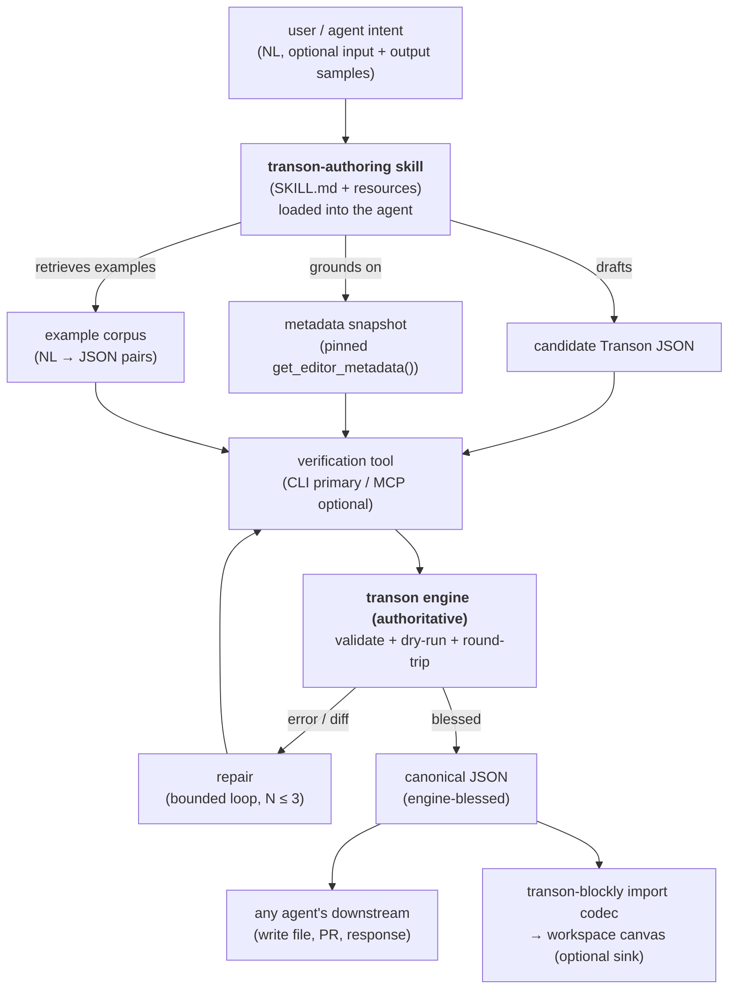

# SPEC — Transon Authoring Skill (`transon-authoring`)

A standalone, distributable capability that lets **any AI agent in the org** author correct,
canonical **Transon** JSON — grounded in engine-authoritative metadata and verified by the engine
before it is ever returned. It lives in its own repository, **beside** (not inside) the
`transon-blockly` editor and the `transon` engine.

> **Status:** Draft (pre-A0). This document is the contract for the project — behavior changes update
> this SPEC first, then code (see §12 governance).

---

## 0. Namespace & relationship to other repos

This is a **separate contract** from the editor's `docs/SPEC.md`. IDs here are independent and
**append-only** within this project; never renumber, deprecate in place. (The editor maintains its own
independent FR/NFR/AD numbering; the two documents are not cross-referenced by ID.)

| Repo | Role | Bound by editor AD-008 (engine-free)? |
|---|---|---|
| `transon` (engine) | Owns `get_editor_metadata()`; executes templates; **authoritative** | n/a |
| `transon-blockly` (editor) | Visual editor; engine-free; consumes authored JSON via its import codec | yes |
| **`transon-authoring` (this repo)** | Authoring capability for AI agents; **may embed the engine** | **no** — see AD-002 |

The three assets share one ground truth: the engine's editor-metadata export.

---

## 1. Problem & motivation

Modern AI agents (Claude Code, Cursor, CI bots, product-embedded agents, docs assistants) are
increasingly asked to produce Transon templates. Left to their own devices they **hallucinate
Transon syntax** — inventing operators, misusing modes, emitting JSON that does not round-trip or
does not run — because the authority for Transon semantics is *the running engine + engine
SPECIFICATION*, **not** model memory, generative web docs, or Context7.

Today that authority is reachable only two ways: hand-authoring against the engine, or the editor's
dev-harness `transon-authoring` skill (scoped to *building the editor*, not *authoring templates as
an end user*). There is no portable, first-class asset that any agent in the org can pick up to
author Transon correctly. This project is that asset.

## 2. Goals

- **G1** — One authoring capability, consumable by *any* agent tool, that reliably produces
  **canonical, engine-valid** Transon JSON from a natural-language intent. (Editor representability —
  "in-surface" — is *not* a goal of the output contract; see AD-013 / OQ-005.)
- **G2** — Ground every generation in **authoritative, current** engine metadata, not training data.
- **G3** — **Verify before return**: never surface a template the engine has not blessed.
  Generate → validate → repair, bounded, and honest about failure.
- **G4** — Ship as a **single-source, multi-tool** asset (portable core + thin per-tool adapters
  + a parity gate), matching the org's harness philosophy.
- **G5** — Stay **decoupled** from the editor's lifecycle and constraints; the editor is one
  optional consumer, not the host.

## 3. Non-goals

- **Not** an in-editor chatbot or a host `AssistantProvider` seam (the rejected "blocks + chatbot" framing).
- **Not** a new transformation DSL, path syntax, or inline expression language (inherits editor §21.8 in spirit).
- **Not** a Transon *runtime* — it authors templates; the engine executes them.
- **Not** a general no-code / workflow platform. It emits the same JSON a human could have hand-authored, only faster.
- **Not** bound by the editor's engine-free rule (see AD-002).

## 4. Consumers (personas)

| Consumer | Environment | Reach to engine |
|---|---|---|
| Coding agent (Claude Code, Cursor) | has a shell | CLI (Bash) — **primary** |
| Product / embedded agent | tool-use only, no shell | MCP / HTTP |
| CI / migration bot | headless shell | CLI |
| Docs / support assistant | tool-use | MCP / HTTP |
| `transon-blockly` editor | browser | consumes the **output JSON** via its import codec |

## 5. Architecture



The skill produces **JSON only**. It never emits blocks. If the editor is the sink, its existing
JSON→workspace codec projects the result onto the canvas — no new editor code required.

## 6. Architecture decisions (AD-style, append-only)

- **AD-001 — Skill *package*, not skill file.** The deliverable is a standalone repo/package
  (`SKILL.md` + bundled resources + verification tool), not an in-repo snippet. It must travel to
  every agent, independent of the editor repo.
- **AD-002 — Engine-dependent by design.** Unlike the editor (AD-008, engine-free), this project
  **may and must** embed or depend on the engine to close the verification loop. It is a different
  artifact with a different contract and does **not** inherit AD-008.
- **AD-003 — Engine is authority.** Metadata comes from the engine's `get_editor_metadata()`;
  validity is decided by the engine, never by the model or generative docs. Mirrors editor AD-012.
- **AD-004 — Verify-before-return.** No candidate is returned unless the engine validated it and
  it round-trips as canonical, in-surface JSON. On failure, return a structured error — never a
  plausible guess. Mirrors editor AD-004 discipline.
- **AD-005 — Single-source, multi-tool.** One canonical skill body; thin adapters for Claude Code,
  Cursor, and MCP. A parity gate keeps adapters honest. Mirrors `harness/README.md` governance.
- **AD-006 — CLI-first verification, MCP optional.** The verification tool is a bundled CLI
  (`transon-verify`) usable by any shell-capable agent; the MCP server is a thin wrapper over the
  **same** CLI for shell-less agents. One implementation, two surfaces.
- **AD-007 — Snapshot pinned + drift-gated.** The bundled metadata snapshot is versioned against
  an engine version, carries provenance, and a CI gate fails on drift. Mirrors the editor's
  `update_memory.py --check`.
- **AD-008 — Output is canonical Transon JSON only.** No IR, no DSL, no new surface. The output
  must be something a human could have authored by hand.
- **AD-009 — Convention-first installation.** Each shipped adapter installs through its tool's
  *native* convention (Claude Code skill/plugin mechanism; Cursor rules + MCP config), not a
  bespoke installer. Installation is idempotent, version-pinned, and reversible.
- **AD-010 — Eval-driven improvement.** The skill improves only through the eval loop: every
  regression or newly-failing intent becomes a captured eval case, and a declared target pass rate
  gates changes. Improvements are never merged on subjective judgement alone.
- **AD-011 — Measurement precedes authoring.** The eval harness, the seed eval set, and the declared
  target pass rate (NFR-010) must exist and be runnable **before the skill body is authored**. The
  skill is written *against a measure*, never ahead of one — its first non-trivial version is scored,
  not assumed. Milestone order enforces this (§14).
- **AD-012 — Native-embedded engine by default.** Both the `transon-verify` CLI and the MCP server
  execute verification against the **same pinned engine embedded in-process** (Python); no network is
  required (NFR-003). A **hosted HTTP engine endpoint** is an optional, documented fallback for hosts
  that cannot embed the engine. A **WASM/Pyodide** build is deferred until a browser-only consumer
  actually exists. (Resolves OQ-001.)
- **AD-013 — Engine-valid is the output contract; in-surface is not enforced.** The skill may author
  **any engine-valid template**. Editor representability ("in-surface") is a property of one optional
  consumer and is **neither required nor gated**. When the editor is the sink, its import codec
  handles any unsupported constructs best-effort; the skill discloses, it does not gate. Supersedes
  the "in-surface" language previously in G1 / FR-006 / UC-002. (Resolves OQ-005.)

## 7. Functional requirements

### Authoring core
- **FR-001** — Given an NL intent, the skill drafts candidate Transon JSON grounded in the
  bundled metadata snapshot.
- **FR-002** — Accept optional **input sample(s)** and optional **target output sample(s)**; when
  present, use them to drive a dry-run / example-based verification (not just static validation).
- **FR-003** — Expose authoring tools to the model: `get_metadata()`, `search_examples(query)`,
  `validate(json)`, `dry_run(json, input)`. The model calls these rather than one-shotting.

### Verification loop
- **FR-004** — Run every candidate through engine `validate` (structural/semantic) before returning.
- **FR-005** — When an input sample is provided, run `dry_run` and compare against the target
  output sample if given; treat mismatch as a repair signal.
- **FR-006** — Perform an **engine-canonical round-trip check** (engine import→export equivalence):
  the output must be stable/idempotent under the engine's own normalization. Non-round-tripping
  output is a failure, not a warning. **Editor round-trip / in-surface is not checked** (AD-013) — it
  is a property of one optional consumer, not a gate on the output contract.
- **FR-007** — On any failure, feed the **verbatim engine error/diff** back to the model and
  retry, bounded to N attempts (default 3, configurable).
- **FR-008** — If the loop exhausts without a blessed result, return a **structured failure**:
  last candidate, last engine error, and a plain-language explanation. Never return unverified JSON
  as if valid.

### Grounding & corpus
- **FR-009** — Bundle a pinned `get_editor_metadata()` snapshot (operators, functions, params,
  **modes/variants**) as the sole grounding source.
- **FR-010** — Bundle an NL→JSON **example corpus** drawn from the editor's round-trip corpus;
  `search_examples` retrieves relevant ones into context.
- **FR-011** — Provide a `sync-metadata` command that regenerates the snapshot from a given
  engine version and records provenance.

### Distribution
- **FR-012** — Ship a canonical `SKILL.md` plus per-tool adapters for Claude Code (`.claude/`) and
  Cursor (`.cursor/`), pointing at the single-source body.
- **FR-013** — Ship an MCP server exposing the verification tools for shell-less agents (AD-006).
- **FR-014** — Provide a `transon-verify` CLI usable standalone (outside any agent) for scripts and CI.

### Installation
- **FR-015** — Provide a **conventional installation procedure for each shipped tool**, documented
  and scripted, that installs the skill through the tool's native mechanism (AD-009):
  - **Claude Code** — install as a skill/plugin into the correct scope, documenting both **personal**
    (`~/.claude/`) and **project** (`.claude/` in-repo) installs.
  - **Cursor** — install the adapter into `.cursor/` (rules) *and* register the MCP server (FR-013)
    in the tool's MCP configuration.
  - Each install pins the skill version + engine version/snapshot hash it was built against (NFR-008).
- **FR-016** — Installation is **idempotent and reversible**: re-running the install produces the
  same result without duplication, and a documented uninstall cleanly removes the adapter and any
  MCP registration.

### Improvement loop
- **FR-017** — Maintain an **eval-driven improvement loop** (AD-010): a documented procedure to go
  from a failing/regressing intent → captured eval case → change to corpus/`SKILL.md`/tools → re-eval,
  measured against the declared target pass rate (NFR-010). The loop's measurement half (harness +
  seed eval set + target) is stood up **before** the skill body is authored (AD-011).
- **FR-018** — **Capture failing cases.** Every intent that fails in the loop (FR-008) or is
  reported from real use is added to the eval set as a regression fixture, so it cannot silently
  regress again.

### Install & discoverability CI
- **FR-019** — **CI install + discoverability check.** CI installs the skill into a clean Claude Code
  environment and a clean Cursor environment via the documented procedure (FR-015) and asserts, for
  each, that the host tool actually **discovers** it — not merely that files were copied:
  - **Claude Code** — the skill is enumerated/loadable by the tool (appears in its skill listing with
    the expected name/description from `SKILL.md`).
  - **Cursor** — the adapter rule is present and well-formed in the expected location (structural
    check, pending OQ-008) *and* the registered MCP server (FR-013) is reachable and lists the
    expected verification tools (behavioral check).
  The check fails CI on missing install, non-idempotent re-install, or non-discovery (NFR-009).

## 8. Non-functional requirements

- **NFR-001 — Authority isolation.** No Transon semantics may originate from LLM memory,
  generative web docs, or Context7. The snapshot + engine are the only truth. (Context7 is permitted
  only for host-tooling API docs, per editor precedent.)
- **NFR-002 — Deterministic gate.** Verification is engine-deterministic; the same JSON+input
  yields the same verdict. Model creativity is bounded upstream of an objective gate a weaker model
  cannot bypass.
- **NFR-003 — Portability.** Works in shell-capable agents with zero network (bundled engine) and
  in shell-less agents via MCP/HTTP.
- **NFR-004 — Snapshot freshness.** The drift gate (AD-007) fails CI when the bundled
  snapshot diverges from the pinned engine version.
- **NFR-005 — Honest failure.** Failure output is always distinguishable from success; no silent downgrade.
- **NFR-006 — Bounded cost.** The repair loop is capped (FR-007) so a hard case cannot burn
  unbounded tokens/time.
- **NFR-007 — Parity.** Every capability is equally available across shipped adapters, or carries
  an explicit documented exclusion.
- **NFR-008 — Versioned contract.** Skill releases are versioned and record the engine version +
  snapshot hash they were built against.
- **NFR-009 — Installability & discoverability.** Installation into each supported tool succeeds from
  a clean environment via the documented procedure (FR-015), is idempotent and reversible (FR-016),
  and requires no manual editing of tool internals. After install, the skill is **discoverable by the
  host tool** — enumerated/loadable by Claude Code and loaded (rule + registered MCP server) by
  Cursor. Both properties are enforced in CI (FR-019).
- **NFR-010 — Eval regression gate.** The eval set carries a **declared, versioned target pass
  rate**; a change that drops below it (or regresses a captured fixture) fails the gate. The target
  is recorded in `evals/` and moves only by explicit decision, never silently. **Initial targets
  (OQ-006):** authoring (should-succeed) evals **≥ 80%**, ratcheting toward **95%** — the floor rises
  to the last release's achieved rate and never falls; adversarial (should-refuse) evals **= 100%**
  as a never-regress invariant, since a fabricated operator/mode must never pass (AC-003).

## 9. Acceptance criteria & use cases

### Acceptance criteria
- **AC-001** — Given "flatten each order's line items with the customer name" and an input sample,
  the skill returns JSON the engine validates *and* whose dry-run output matches the provided target.
  Returned only if engine-blessed.
- **AC-002** — Given an intent requiring a mode/variant (mutually exclusive params), the emitted
  JSON uses the correct engine mode; round-trip is stable.
- **AC-003** — Given an intent that references a non-existent operator, the skill does **not**
  invent it; it either finds the real operator via metadata or returns a structured failure.
- **AC-004** — With no input sample, static validation + round-trip still gate the output;
  unverifiable dynamic behavior is disclosed, not hidden.
- **AC-005** — The same intent produces byte-identical verdicts (valid/invalid) across the CLI and
  MCP surfaces (one implementation).
- **AC-006** — When the engine version bumps and metadata changes, the drift gate fails until
  `sync-metadata` regenerates the snapshot.
- **AC-007** — From a clean Claude Code environment and a clean Cursor environment, the documented
  install procedure (FR-015) yields a working skill in each; re-running it changes nothing
  (idempotent), and uninstall removes it cleanly.
- **AC-008** — A change that drops the eval pass rate below the declared target, or regresses a
  captured fixture (FR-018), fails the eval regression gate (NFR-010) and cannot merge.
- **AC-009** — In CI, installing into a clean Claude Code environment makes the skill appear in the
  tool's skill listing, and installing into a clean Cursor environment places a well-formed rule and
  exposes the MCP server's verification tools; a build where either tool fails to discover the skill
  is red (FR-019; Cursor rule-ingestion depth per OQ-008).

### Use cases
- **UC-001** — A Claude Code agent authors a template in-repo, verifies via the Bash CLI, and
  opens a PR with engine-green JSON.
- **UC-002** — A shell-less product agent authors via MCP tools and hands the JSON to the
  `transon-blockly` import codec. The editor renders what it supports best-effort; editor
  representability is not guaranteed by the skill (AD-013).
- **UC-003** — A CI migration bot batch-upgrades a corpus of templates, using `transon-verify` to
  gate each.
- **UC-004** — A new engineer installs the skill into their Claude Code (personal scope) and Cursor
  by following the documented procedure, and authors a verified template without touching tool internals.

## 10. Proposed package layout

```
transon-authoring/                 # this repo
├── SKILL.md                       # canonical authoring contract (single source)
├── resources/
│   ├── metadata-snapshot.json     # pinned get_editor_metadata()        (FR-009)
│   ├── metadata-snapshot.md       # provenance: engine version, hash, date
│   └── corpus/                    # NL → JSON worked examples           (FR-010)
├── verify/                        # the verification tool               (AD-006)
│   ├── cli.(py|ts)                # transon-verify: validate | dry-run | round-trip
│   └── engine/                    # bundled/pinned engine dep           (AD-002)
├── mcp/                           # thin MCP wrapper over verify/        (FR-013)
├── adapters/
│   ├── claude/                    # .claude/ adapter → points at SKILL.md
│   └── cursor/                    # .cursor/ adapter → points at SKILL.md
├── install/                       # conventional install/uninstall      (FR-015 / FR-016)
│   ├── claude.(py|ts|sh)          # install into ~/.claude or ./.claude
│   └── cursor.(py|ts|sh)          # install .cursor rules + register MCP
├── scripts/
│   ├── sync_metadata.(py|ts)      # regenerate snapshot from engine     (FR-011)
│   ├── check_snapshot.(py|ts)     # drift gate                  (AD-007 / NFR-004)
│   ├── check_parity.(py|ts)       # adapter parity gate                 (NFR-007)
│   ├── check_evals.(py|ts)        # eval regression gate                (NFR-010)
│   └── check_install.(py|ts)      # CI install + discoverability gate   (FR-019)
├── evals/                         # NL→JSON authoring evals + target    (§13)
└── docs/
    ├── SPEC.md                    # this document
    └── adr/                       # architecture decision records
```

## 11. The verification-loop contract (the core deliverable)

```
verify(candidate_json, { input_sample?, target_output? }) -> Verdict

Verdict = {
  ok: boolean,
  stage: "validate" | "dry_run" | "round_trip",   # where it passed / failed
  errors: EngineError[],                            # verbatim engine output
  normalized_json?: object,                         # canonical form on success
  diff?: object                                     # dry-run vs target on mismatch
}
```

Loop (executed by the skill, bounded by N):

1. Draft JSON grounded in snapshot + retrieved examples.
2. `validate` → on error, repair with the verbatim error, retry.
3. If `input_sample`: `dry_run`; if `target_output`: diff → repair on mismatch.
4. `round_trip` (import→export) → must be canonical + in-surface, else repair.
5. Return blessed `normalized_json`, or a structured failure after N.

**Invariants.** The model never decides validity; only `verify` does. Every error fed back is the
engine's actual output, not a paraphrase. Success is always engine-blessed and round-trip-stable.

## 12. Governance

- **SPEC-first.** Behavior changes update this document before code; flag conflicts before coding.
- **Append-only IDs.** FR/NFR/AC/UC/AD/OQ take the next free number; deprecate in place, never renumber.
- **Maker ≠ checker.** Do not gate a slice you implemented; run the parity + drift + eval gates on any
  branch that touches the verification tool, the snapshot, the adapters, or the eval set.
- **Single-source, multi-tool.** New agent tooling → a new adapter over the same `SKILL.md`, or an
  explicit documented exclusion (NFR-007).
- **Measurement precedes authoring.** No PR may author or materially change the skill body before the
  eval harness + seed set + declared target exist and run (AD-011). Reviewers reject skill-body work
  that lands ahead of its measure.

## 13. Testing & gates

- **Authoring evals** — NL intents (with/without samples) → assert engine-green + round-trip-stable
  output; track pass rate as the headline quality metric against the declared target (NFR-010).
- **Adversarial evals** — intents that bait invented operators / wrong modes → assert the skill
  refuses to fabricate (AC-003).
- **Snapshot drift gate** — `check_snapshot` in pre-commit + CI (NFR-004).
- **Parity gate** — `check_parity` across adapters (NFR-007).
- **Cross-surface equivalence** — CLI vs MCP produce identical verdicts (AC-005).
- **Eval regression gate** — `check_evals` fails when the pass rate drops below the declared target
  or a captured fixture regresses (NFR-010 / FR-018).
- **Install & discoverability gate** — `check_install` runs the documented install procedure in CI
  from a clean environment for each tool, then asserts the host tool **discovers** the skill (Claude
  Code lists it; Cursor loads the rule + reaches the MCP server), idempotently (NFR-009 / FR-019 /
  AC-007 / AC-009).

## 14. Milestones

- **A0 — Grounding spine.** Repo, `SKILL.md` skeleton, snapshot + provenance + drift gate, corpus
  seed. *DoD:* an agent can load authoritative metadata; drift gate green.
- **A1 — Verification tool.** `transon-verify` CLI (validate / dry-run / round-trip) over a pinned
  engine. *DoD:* CLI blesses/rejects JSON deterministically; AC-001/003 pass by hand.
- **A2 — Measurement spine (before any skill body).** Eval harness over the A1 verification tool,
  seed eval set, declared target pass rate, and regression gate — with only a trivial skill stub.
  *DoD:* the harness can score an arbitrary candidate skill body and the regression gate runs
  red/green (NFR-010); no non-trivial skill body authored yet (AD-011).
- **A3 — Authoring loop.** *Now* author the skill body: draft→verify→repair, example retrieval,
  measured against the A2 harness. *DoD:* authoring evals hit the target pass rate; honest failure on
  hard cases; failing cases captured (FR-018).
- **A4 — Multi-tool distribution.** Claude Code + Cursor adapters, MCP wrapper, parity gate,
  conventional install/uninstall + CI install & discoverability gate. Claude Code ships first as a
  plain `.claude/skills/` install to satisfy the gate; plugin packaging (co-registering the MCP
  server, versioned/updatable) follows as the durable channel (OQ-007). *DoD:* AC-005 + AC-007 +
  AC-009 + parity green across surfaces; each tool discovers the installed skill in CI.
- **A5 — Editor sink + polish.** Verified JSON flows into the `transon-blockly` import codec
  end-to-end; docs, versioned release. *DoD:* UC-002 demoed.

## 15. Open questions

> Resolved questions are kept in place (append-only) with their decision and date; they are not deleted.

- **OQ-001** — Engine reach for shell-less agents: bundle a WASM/Pyodide engine for offline MCP,
  or require a hosted engine endpoint?
  **Resolved (2026-07-09):** Native-embedded engine by default in both CLI and MCP server; hosted
  HTTP endpoint an optional documented fallback; WASM/Pyodide deferred until a browser-only consumer
  exists. Captured as **AD-012**.
- **OQ-002** — Repo ownership: standalone repo vs. a package inside the engine repo (closer to
  metadata source).
  **Resolved (2026-07-09):** **Standalone repo**, per **AD-001**. Cross-repo metadata freshness is
  handled by the drift gate + `sync-metadata` (see OQ-004), not by colocation.
- **OQ-003** — How much of the editor's round-trip corpus can be reused directly vs. needs
  authoring-oriented NL prompts written fresh?
  **Resolved (2026-07-09):** Reuse the editor's vetted round-trip **JSON as canonical targets**;
  author **NL intents fresh** (LLM back-translation allowed only as a human-curated draft). Adversarial
  baits (AC-003) authored from scratch. Exact reuse ratio settled empirically during A0/A2 seeding.
- **OQ-004** — Snapshot sync automation: manual `sync-metadata` on engine release, or a
  CI trigger subscribed to the engine repo?
  **Resolved (2026-07-09):** **Manual `sync-metadata` backed by the drift gate now** (nothing stale
  can ship regardless); add a **scheduled-poll bot** that opens a ready-to-review PR as a fast-follow.
  Push-based cross-repo trigger rejected (couples to a repo we don't own).
- **OQ-005** — Does "in-surface" (editor supported surface) constrain the skill's output, or may
  the skill author *any* engine-valid template?
  **Resolved (2026-07-09):** **Always engine-valid; in-surface never enforced.** Captured as
  **AD-013**; reconciled in G1, FR-006, UC-002.
- **OQ-006** — Initial value of the declared target pass rate (NFR-010) and its ratchet.
  **Resolved (2026-07-09):** Authoring evals **≥ 80% → 95%** (floor ratchets up, never down);
  adversarial evals **= 100%** never-regress. Recorded in **NFR-010**; values live in `evals/`.
- **OQ-007** — Claude Code install channel (FR-015): plugin vs. plain skill in `.claude/skills/`.
  **Resolved (2026-07-09):** **Phased** — plain `.claude/skills/` install first to pass the A4
  discoverability gate cheaply, then **plugin packaging** (co-registers MCP, versioned/updatable) as
  the durable channel. Reflected in **A4**.
- **OQ-008** — *(open)* Cursor rule loading has no headless API; CI can verify the rule file is
  well-formed and correctly placed and can behaviorally check the MCP server, but "Cursor actually
  ingested the rule" may only be assertable structurally. Confirm the strongest discoverability check
  Cursor allows for FR-019. Decide before A4.

## 16. Risks

- **Snapshot rot** → mitigated by the drift gate (AD-007).
- **Verification bypass** (model "declares" success) → structurally impossible: the return path goes
  only through `verify` (AD-004).
- **Scope creep toward a runtime/DSL** → guarded by AD-008 + §3 non-goals.
- **Adapter divergence** → parity gate (NFR-007).
- **Cost blowup on hard intents** → bounded loop (NFR-006).
- **Install drift across tools** → convention-first install + CI install & discoverability gate
  (AD-009 / NFR-009 / FR-019).
- **Skill installs but host tool never loads it** (silent non-discovery) → discoverability asserted
  in CI, not just file placement (FR-019 / AC-009).
- **Silent quality regression** → eval regression gate + failing-case capture (NFR-010 / FR-018).
