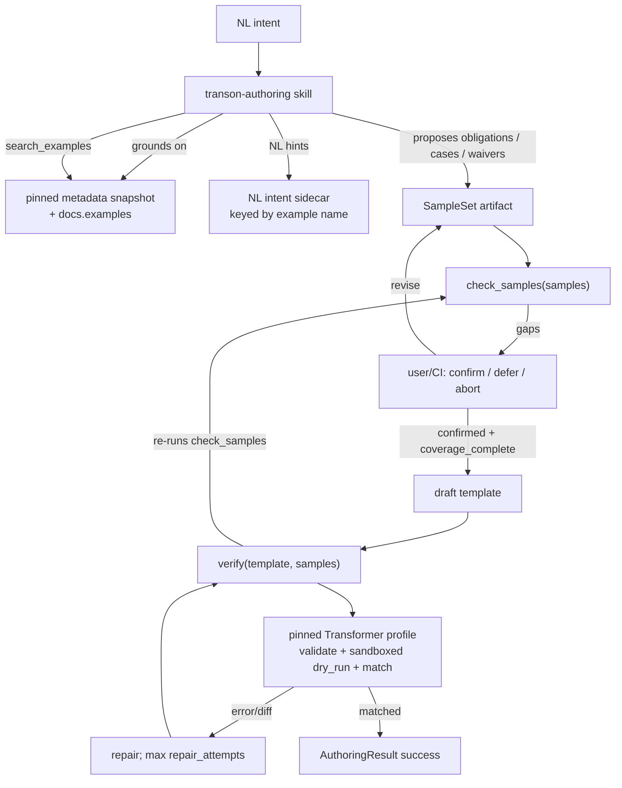

# SPEC — Transon Authoring Skill (`transon-authoring`)

A standalone, distributable capability that lets **coding agents and CI** in the org author
correct, engine-valid **Transon** JSON — grounded in engine-authoritative metadata, backed by a
**user-confirmed SampleSet**, and blessed by the engine at **`matched`** assurance before any
template is returned. It lives in its own repository, **beside** (not inside) the
`transon-blockly` editor and the `transon` engine.

> **Status:** Draft (pre-A0). This document is the contract for the project — behavior changes
> update this SPEC first, then code (see §12 governance).
>
> **Pre-A0 note:** Until A0 is approved/started, requirement and decision text may be rewritten in
> place to keep the draft coherent. **From A0 onward**, FR/NFR/AC/UC/AD/OQ IDs are append-only:
> never renumber; deprecate in place; new items take the next free number.

**Initial engine pin (A0 baseline):** `transon==0.1.7` with `metadata_version` `"3.0"`
(authoritative evidence: engine repo `pyproject.toml` version `0.1.7`;
`transon-blockly/docs/metadata-snapshot.json` records `engine_version` `0.1.7` and
`metadata_version` `3.0`). See AD-007 / §11.7.

---

## 0. Namespace & relationship to other repos

This is a **separate contract** from the editor's `docs/SPEC.md`. IDs here are independent of the
editor's numbering; the two documents are not cross-referenced by ID.

| Repo | Role | Bound by editor AD-008 (engine-free)? |
|---|---|---|
| `transon` (engine) | Owns `get_editor_metadata()`; executes templates; **authoritative** | n/a |
| `transon-blockly` (editor) | Visual editor; engine-free; consumes authored JSON via its import codec | yes |
| **`transon-authoring` (this repo)** | Authoring capability for AI agents; **may embed the engine** | **no** — see AD-002 |

The product name is **`transon-authoring`**. Any earlier editor-dev harness skill of the same name
is temporary and is removed or redirected once this package ships (A4+).

Architecture decisions live in **§6**. If the SPEC grows too large, extract `ARCHITECTURE.md`; if
that grows too large, split ADs into `docs/adr/`. Do not create empty ADR files up front.

---

## 1. Problem & motivation

Coding agents (Claude Code, Cursor) and CI bots are increasingly asked to produce Transon
templates. Left alone they **hallucinate Transon syntax** because authority is the **running pinned
engine + engine SPECIFICATION + pinned metadata export**, not model memory, generative web docs, or
Context7.

Static validation is also insufficient without a **confirmed SampleSet** whose cases satisfy
**declared coverage obligations**. This project: ground in metadata, craft/confirm samples, then
`verify` to **`matched`**.

---

## 2. Goals

- **G1** — From NL intent → sample loop (propose obligations → cases/waivers → user/CI confirm) →
  engine-valid JSON that `verify` blesses at **`assurance: "matched"`**. Editor "in-surface" is
  **not** part of the output contract (AD-013), subject to the v1 execution profile (AD-017).
- **G2** — Ground generation in the **pinned** metadata snapshot (and engine docs examples), not
  training data. “Current” means **current relative to the pin** (§11.7), not “latest on PyPI.”
- **G3** — **Verify before return**: never return a template unless `verify` yields `matched`.
- **G4** — Single-source skill + Claude Code and Cursor adapters + parity gate.
- **G5** — Decoupled from the editor; editor is an optional JSON sink.

## 3. Non-goals

- Not an in-editor chatbot / `AssistantProvider`.
- Not a new DSL, path syntax, or expression language.
- Not a Transon runtime (authors templates; engine executes).
- Not a workflow / no-code platform.
- Not bound by editor engine-free AD-008 (see AD-002).
- Not MCP, hosted HTTP engine, or WASM/Pyodide in v1.
- Not shell-less product/docs agents in v1.
- Not editor in-surface checking/disclosure.
- Not real filesystem/network I/O in `verify` dry-run (including inside timeout worker subprocesses).
- Not custom `Transformer` subclasses, custom rule/operator/function registries, or non-default
  markers as a **verify execution profile** in v1 (AD-017) — templates always run under `"$"`.

## 4. Consumers

| Consumer | Environment | Reach |
|---|---|---|
| Coding agent (Claude Code, Cursor) | shell | `python -m transon_authoring …` |
| CI / migration bot | headless shell | same; pre-confirmed SampleSet fixtures |
| `transon-blockly` | browser | optional sink via import codec |

---

## 5. Architecture



**Runtime (AD-006):** Python library is the contract; agents/CI use `python -m transon_authoring`.
No console-script product; no MCP.

---

## 6. Architecture decisions

- **AD-001 — Skill package.** Standalone repo/package (`SKILL.md` + resources + library).
- **AD-002 — Engine-dependent.** May/must embed the engine; does not inherit editor AD-008.
- **AD-003 — Engine is authority.** See AD-018 for precedence among engine, SPECIFICATION, snapshot.
- **AD-004 — Verify-before-return.** Success only if `verify` → `ok: true`, `assurance: "matched"`.
  `verify` **re-validates** the SampleSet via `check_samples` and rejects unless
  `ok_for_verify` (AD-019). Structured failure otherwise (§11.5).
- **AD-005 — Single-source, multi-tool.** One `SKILL.md`; Claude + Cursor adapters; parity gate.
- **AD-006 — Library-first; module entry.** APIs: `get_metadata`, `search_examples`,
  `check_samples`, `verify` (+ debug `validate` / `dry_run`). Invoked via
  `python -m transon_authoring` (§11.6).
- **AD-007 — Pin + drift + upgrade.** Depend on **`transon==0.1.7`** initially. Bundle
  `get_editor_metadata()` snapshot with provenance (`engine_version`, `metadata_version`, content
  hash, sync date). **Drift gate** compares the bundle to metadata produced by the **pinned**
  install — it does **not** detect newer PyPI releases. **Staleness/upgrade:** a scheduled or
  manual check against PyPI/latest engine opens a pin-bump PR; humans run `sync-metadata`, update
  `pyproject.toml` pin, refresh NL sidecar as needed, and merge deliberately (OQ-004 still applies
  for automation shape).
- **AD-008 — Ordinary JSON output.** No IR/DSL; no verifier-owned key-order canonicalization.
- **AD-009 — Convention-first install.** Native Claude/Cursor paths (§11.9); no MCP.
- **AD-010 — Eval-driven improvement.** Changes gated by NFR-010 / AD-020.
- **AD-011 — Measurement before skill body.** A2 before A3.
- **AD-012 — Pinned engine package; local execution only.** Verification depends on the pinned
  `transon` **Python package** loaded in the same environment — no hosted HTTP, WASM/Pyodide, or
  MCP. Dry-run cases MAY run in a **short-lived local worker subprocess** that imports that same
  package (AD-017 timeout isolation). That is still local/embedded execution, not a remote engine.
- **AD-013 — Engine-valid under v1 profile; no editor-surface awareness.** Output may be any
  template valid for the **v1 execution profile** (AD-017), not “any conceivable engine subclass.”
  No in-surface check/disclosure.
- **AD-014 — Samples before draft.** No draft until `coverage_complete` and user/CI confirmation
  are both true (separate flags — AD-016). CI uses pre-confirmed fixtures.
- **AD-015 — Sandboxed `file` / `include`.** In-memory write capture + explicit `includes` map;
  forbid real FS/network in dry-run. Expected writes live on sample cases.
- **AD-016 — Obligations in SampleSet; deterministic `check_samples`.** Model proposes coverage
  obligations; user/CI accepts/rejects them and confirms the SampleSet. `check_samples` only
  checks the artifact — it never parses NL. **`coverage_complete` ≠ `confirmed`.**
- **AD-017 — v1 execution profile (how verify executes).** `verify` / dry-run **always construct**
  `transon.Transformer` with:
  - the base class only (never a subclass);
  - built-in rule/operator/function registries as shipped in the pinned package;
  - default marker `"$"` (`Transformer.DEFAULT_MARKER`);
  - `max_include_depth=50` (engine default);
  - sandboxed `file_writer` + `template_loader` (AD-015);
  - the engine’s R-32 **one core recursion frame per template node** (pinned `0.1.7`; over-depth
    surfaces as include `TransformationError`, never raw `RecursionError`);
  - per-case wall-clock timeout **5s**, enforced by running each dry-run case in a **local worker
    subprocess** that imports the pinned package, applies the same sandbox delegates, and returns
    `{result, writes, errors}` over IPC. On timeout the worker is killed → `TimeoutError`,
    `failed_stage: "dry_run"`. Subprocess isolation does not change match semantics (NFR-002): same
    SampleSet + template + pin ⇒ same Verdict. Sandbox invariants (AD-015) hold inside the worker
    (no FS/network). The library/CLI **MUST NOT** expose knobs for non-default marker, transformer
    class, or registries in v1; explicit requests for those are rejected with `ProfileError` before
    any engine call (AC-027). Trust boundary: trusted local agents/CI only.
- **AD-018 — Authority precedence.** (1) behavior of the **pinned running engine**;
  (2) engine `docs/SPECIFICATION.md` for that version; (3) pinned `get_editor_metadata()` snapshot
  for catalog/examples structure; (4) NL intent sidecar (hints only). Never LLM memory / web /
  Context7 for Transon semantics (NFR-001).
- **AD-019 — `verify` re-checks SampleSet.** No unforgeable token. `verify` runs `check_samples`
  on the provided SampleSet and requires `ok_for_verify` before validate/dry_run/match.
- **AD-020 — Eval runner policy (resolves OQ-009).** See §11.8. Committed `evals/runner.json`
  pins provider/model/settings; 3 runs/fixture majority-of-3; population = all committed fixtures;
  ratchet and privacy rules normative.

---

## 7. Functional requirements

### Authoring core
- **FR-001** — Given NL intent and a SampleSet with `coverage_complete` and `confirmed`, draft
  candidate JSON grounded in the pinned snapshot (AD-018).
- **FR-002** — Authoring is driven by a **SampleSet** (§11.1): cases, obligations, waivers,
  optional `includes`, confirmation. Required for success.
- **FR-003** — Model-facing operations: `get_metadata`, `search_examples`, `check_samples`,
  `verify` via library / `python -m`. Debug `validate` / `dry_run` are not blessing paths.

### Sample loop
- **FR-020** — `check_samples(samples: SampleSet) -> SampleCheck` (§11.1). Deterministic.
  Returns separate `coverage_complete` and `confirmed` (and `ok_for_verify`).
- **FR-021** — Persist SampleSet with `schema_version` `"1.0"` and all fields in §11.1.
- **FR-022** — Repo config `.transon-authoring.json` (§11.9). First **interactive** use without
  config asks layout; CI/non-interactive never asks.
- **FR-023** — Exits: **confirm** / **defer** / **abort** (§11.5). Sample conversation unbounded
  until one exit; no auto-confirm.
- **FR-024** — Present gaps with proposed waivers/assumptions; user accepts/rejects; persist
  structured waivers that clear obligation ids.
- **FR-025** — Skill proposes `coverage` obligations inside the SampleSet from NL (never as a
  separate free-form inference step inside the library).

### Verification
- **FR-004** — After SampleSet preflight, run engine `validate`.
- **FR-005** — Sandboxed dry-run per case; match via §11.4 (including optional `writes`).
- **FR-006** — Stages: `samples` → `validate` → `dry_run` → `match` only (no engine round-trip).
- **FR-007** — On verify failure, feed verbatim engine errors/diff; repair up to
  **`repair_attempts`** times. **Counting:** `repair_attempts` = max number of **repair** cycles
  after a failed `verify` (default **3**, allowed range **1..10** in `.transon-authoring.json`).
  Total candidates tried ≤ `1 + repair_attempts`. This bound is a **skill-loop** concern: the
  library/`python -m … verify` subcommand performs a **single** deterministic `verify` (NFR-002 /
  AC-018) and does **not** loop or accept `--repair-attempts`. The skill reads `repair_attempts`
  from ProjectConfig when deciding whether to draft another candidate.
- **FR-008** — On exhaustion / defer / abort / reject, return `AuthoringResult` failure (§11.5).
  Never return unverified JSON as success.

### Grounding & corpus
- **FR-009** — Bundle pinned `get_editor_metadata()` snapshot as the structural grounding catalog.
- **FR-010** — **Authoritative example JSON** is `docs.examples` inside that snapshot (flat corpus:
  `{name, doc, template, data, result, tags}` per engine metadata_version 3.0 / editor
  metadata-contract §2.7). **Do not duplicate** those payloads from the editor codec corpus.
  Freshly authored **NL intents** live in `resources/nl-intents.json` (or `.jsonl`) as
  `{ "schema_version": "1.0", "intents": { "<example-name>": { "nl": string, "notes?": string } } }`
  keyed by stable example `name`. `search_examples` retrieves by NL/sidecar + tags/name over the
  snapshot examples. Provenance for the snapshot covers examples; sidecar has its own content hash
  in provenance. **No editor-only corpus entries in v1.** (Revises OQ-003.)
- **FR-011** — `sync-metadata` regenerates snapshot from the pinned engine and records provenance.

### Distribution
- **FR-012** — Canonical `SKILL.md` + Claude/Cursor adapters.
- **FR-013** — **Deprecated (pre-A0; no implementation).** MCP server removed from v1 (§3). Kept
  only so the ID is not reused after A0 lock.
- **FR-014** — `python -m transon_authoring` module entry with subcommands in §11.6.

### Installation
- **FR-015** — Install procedures (§11.9): Claude personal/project skill paths; Cursor
  `.cursor/skills/transon-authoring/`. Pin skill + engine versions in adapter metadata/comments.
- **FR-016** — Idempotent install; uninstall removes **only** files this installer created
  (manifest recorded at install time).

### Improvement
- **FR-017** — Eval-driven loop (AD-010/020).
- **FR-018** — Capture failing cases into evals only after **privacy redaction** and **explicit
  consent** (§11.8). No raw secrets/PII committed.

### Install CI
- **FR-019** — CI install checks:
  - **Claude Code:** structural install at documented path; plus headless listing **if** OQ-010
    resolves positively — until then claim **install integrity**, not “discoverability.”
  - **Cursor:** structural adapter install + `python -m transon_authoring metadata` runtime smoke.
    Do **not** claim Cursor “discovered/ingested” the skill (OQ-008).

### Additional
- **FR-026** — Library and module entry emit/accept only the JSON schemas in §11. Malformed JSON or
  unknown/`unsupported` `schema_version` on ingress → CLI exit **2** and a `schema-error` envelope
  (§11.6); skill-level `AuthoringResult.status === "schema-error"` (§11.5).
- **FR-027** — `verify` must call `check_samples` and require `ok_for_verify` (AD-019).
- **FR-028** — Enforce AD-017 resource limits (timeout, include depth) during dry-run.

---

## 8. Non-functional requirements

- **NFR-001 — Authority isolation.** Transon semantics only from AD-018 sources. Context7 only for
  host-tooling APIs.
- **NFR-002 — Deterministic gates.** Same SampleSet + template + pin ⇒ same `SampleCheck` /
  `Verdict`. Sandboxed I/O only.
- **NFR-003 — Offline after install.** No network required for verify/check/metadata once the
  pinned engine and package are installed (local package import and optional local worker
  subprocesses only).
- **NFR-004 — Snapshot drift vs pin.** `check_snapshot` fails if bundle ≠ metadata from pinned
  `transon==…`. Does not track unpinned newer releases (AD-007).
- **NFR-005 — Honest failure.** §11.5 statuses distinguishable from success.
- **NFR-006 — Bounded repair.** Per FR-007; sample loop unbounded until confirm/defer/abort.
- **NFR-007 — Adapter parity.** Claude/Cursor equal capability or documented exclusion.
- **NFR-008 — Versioned releases.** Record skill version, engine pin, snapshot hash.
- **NFR-009 — Install integrity.** FR-015/016/019; wording is **install integrity + runtime
  smoke**, not host “discoverability,” except where OQ-010 enables a Claude listing check.
- **NFR-010 — Eval regression gate.** Targets (OQ-006): authoring ≥80%→95% ratchet; adversarial
  refuse-class =100%. Exact formula and runner: §11.8 / AD-020.
- **NFR-011 — Privacy.** Real-use fixtures require redaction + consent before commit (FR-018).

---

## 9. Acceptance criteria & use cases

### Acceptance criteria
- **AC-001** — Confirmed complete SampleSet for “flatten each order's line items with the customer
  name” → success `AuthoringResult` with `verdict.assurance === "matched"`.
- **AC-002** — Mode/variant intent → correct engine mode and `matched`.
- **AC-003** — Nonexistent operator/mode with `expect: "refuse"` → no invented name; failure
  envelope; adversarial gate 100%.
- **AC-004** — Without `ok_for_verify` SampleSet → no template; status ∈
  `need-samples`|`deferred`|`aborted`|`samples-rejected`.
- **AC-005** — Claude/Cursor adapters share one `SKILL.md` and same module recipe.
- **AC-006** — Pin/metadata change without sync → drift gate red until `sync-metadata`.
- **AC-007** — Clean install/uninstall idempotent on supported platforms (§11.9).
- **AC-008** — Eval rate below target or fixture regression → gate red (NFR-010).
- **AC-009** — CI: Cursor structural install + module smoke; Claude structural install (listing
  only if OQ-010 allows). No false “discoverability” claims.
- **AC-010** — Unmet obligations → gap codes; skill presents waivers; user accepts/rejects.
- **AC-011** — Conversational confirm writes `confirmation` + binds `content_fingerprint`.
- **AC-012** — Defer → `deferred`; abort → `aborted`; no template.
- **AC-013** — Success ⇒ `verdict.ok && assurance === "matched"` only.
- **AC-014** — CI fixtures with `confirmed` + `coverage_complete`; no layout prompt when config
  present or `--samples` given.
- **AC-015** — Dry-run: no real FS/network; writes captured; includes from map only.
- **AC-016** — Zero cases, malformed SampleSet, `coverage_complete=false`, or unconfirmed →
  `verify` fails at `samples` stage; never `matched`.
- **AC-017** — `coverage_complete` and `confirmed` are independent; both required for
  `ok_for_verify`.
- **AC-018** — Same inputs ⇒ identical `SampleCheck`/`Verdict` semantic content (NFR-002) under
  §11.4/§11.0 equality (object key order insignificant).
- **AC-019** — After `repair_attempts` failed repairs, status `repair-exhausted`; no further tries.
- **AC-020** — With network disabled post-install, `metadata`/`check-samples`/`verify` still work
  (NFR-003).
- **AC-021** — Module subcommands conform to §11.6 (exit codes, stdout JSON envelope).
- **AC-022** — `search_examples` returns snapshot `docs.examples` hits; NL sidecar enriches
  display only.
- **AC-023** — Root engine `NO_CONTENT` does not deep-equal JSON `null` (§11.4).
- **AC-024** — Captured `writes` matched when case declares `writes`; undeclared non-empty writes
  fail match.
- **AC-025** — Eval fixtures from real use lack secrets/PII; consent recorded (NFR-011).
- **AC-026** — Failure envelopes always include `ok: false` and a §11.5 `status`.
- **AC-027** — `verify` always executes under the AD-017 default profile (base `Transformer`,
  marker `"$"`, built-in registries). Explicit profile-violating requests (reserved CLI flags /
  config fields for non-default marker or transformer class) are rejected with `ProfileError`
  before engine execution; skill-level stop uses `status: "profile-rejected"` (§11.5). A template
  JSON that merely *would* need another marker is **not** detectable as a profile violation — it
  runs under `"$"` and fails or succeeds via normal validate/dry_run/match.
- **AC-028** — Per-case dry-run exceeding 5s fails `dry_run` with timeout error.

### Use cases
- **UC-001** — Claude Code: samples → confirm → author → `verify` → PR with template + SampleSet.
- **UC-002** — Cursor same path; optional handoff to blockly import (no in-surface guarantee).
- **UC-003** — CI batch with pre-confirmed SampleSets + committed config; non-interactive.
- **UC-004** — New engineer installs adapters, first-run layout prompt, authors successfully.

---

## 10. Package layout

```
transon-authoring/
├── SKILL.md
├── pyproject.toml                 # depends on transon==0.1.7 (initial pin)
├── src/transon_authoring/
│   ├── __main__.py                # §11.6
│   ├── verify.py
│   ├── samples.py
│   ├── metadata.py
│   ├── examples.py
│   ├── match.py                   # §11.4
│   └── schemas/                   # SampleSet, SampleCheck, Verdict, AuthoringResult, EvalFixture, …
├── resources/
│   ├── metadata-snapshot.json     # get_editor_metadata() pin
│   ├── metadata-snapshot.md       # provenance
│   └── nl-intents.json            # NL sidecar by example name (FR-010)
├── adapters/claude/ … cursor/
├── install/claude.py cursor.py
├── scripts/sync_metadata.py check_snapshot.py check_parity.py check_evals.py check_install.py
├── evals/
│   ├── runner.json                # AD-020 pin
│   ├── targets.json               # NFR-010 rates
│   └── cases/
└── docs/
    ├── SPEC.md
    └── traceability.md            # generated or maintained matrix (§17)
```

---

## 11. Normative contracts

### 11.0 Common types & serialization

```
JsonValue = null | boolean | number | string | JsonValue[] | { [key: string]: JsonValue }

# Tagged values allowed ONLY in SampleCase.output and SampleCase.writes values:
NoContentRef = { "$transon_authoring": "NO_CONTENT" }
LitRef = { "$transon_authoring": "lit", "value": JsonValue }

AuthoringTag =
  | NoContentRef                          # means engine NO_CONTENT sentinel
  | LitRef                                # means the literal JsonValue in "value"
```

**Decoding (normative):** When reading an expected `output` / `writes` value:

1. If it is an object with exactly the keys required for a known tag:
   - `NoContentRef` → compare as engine `NO_CONTENT`;
   - `LitRef` → compare as deep-equal to `value` (use this when the literal data is itself
     `{"$transon_authoring": "NO_CONTENT"}` or any other tagged shape).
2. If it is an object containing `"$transon_authoring"` but is **not** a known tag → SampleSet
   schema failure, gap `schema_invalid` (message: unknown authoring tag).
3. Otherwise treat as ordinary `JsonValue` (including objects that happen to use other keys).

Tagged forms MUST NOT appear inside **templates** or **include** map templates (those are plain
Transon JSON). They are SampleSet expectation encoding only.
**Serialization (stdout):** UTF-8 JSON objects; `json.dumps` with `allow_nan=False`,
`separators=(",", ":")` optional for compactness in CI, pretty-print allowed for humans; **object
key order is not significant** for equality of results; parsers MUST reject duplicate object keys
and non-finite numbers (`NaN`/`Infinity`) at ingress.

**Schema versions:** documents carry `schema_version` string. v1 library understands `"1.0"` for
SampleSet, SampleCheck, Verdict, AuthoringResult, ProjectConfig, NlIntents, EvalRunner,
EvalFixture.

### 11.1 SampleSet & `check_samples`

```
CoverageObligation = {
  id: string,                       # stable within SampleSet
  kind: "happy_path" | "optional_present" | "optional_absent"
      | "list_empty" | "list_singleton" | "list_many" | "mode_choice" | "custom",
  target?: string,                  # JSON pointer (kinds that need structural checks) or
                                    # mode label string for mode_choice; see §11.1 table
  description: string,
  acceptance: "proposed" | "accepted" | "rejected"
}

Waiver = {
  id: string,
  clears_obligation_ids: string[],  # must reference coverage[].id
  reason: string,
  acceptance: "proposed" | "accepted" | "rejected"
}

SampleCase = {
  id: string,
  input: JsonValue,
  output: JsonValue | AuthoringTag,
  writes?: { [name: string]: JsonValue | AuthoringTag },
  satisfies: string[]               # obligation ids this case is claimed to satisfy
}

Confirmation = {
  confirmed: boolean,
  confirmed_by?: "user" | "ci",
  confirmed_at?: string,            # ISO-8601
  note?: string,
  content_fingerprint: string       # hex sha256 over canonical subset (sorted keys):
                                    # schema_version, coverage, waivers, cases, includes
                                    # intent_nl is DELIBERATELY EXCLUDED: it is human context only
                                    # and must not invalidate confirmation when prose is edited
}

SampleSet = {
  schema_version: "1.0",
  intent_nl?: string,
  coverage: CoverageObligation[],
  cases: SampleCase[],
  waivers: Waiver[],
  includes?: { [name: string]: JsonValue },  # include name → template JSON
  confirmation: Confirmation
}

Gap = {
  code: GapCode,
  message: string,
  obligation_id?: string,
  case_id?: string
}

GapCode =
  | "schema_invalid"
  | "missing_happy_path"
  | "optional_present_unmet"
  | "optional_absent_unmet"
  | "list_empty_unmet"
  | "list_singleton_unmet"
  | "list_many_unmet"
  | "mode_choice_unmet"
  | "custom_unmet"
  | "obligation_not_accepted"
  | "waiver_invalid"
  | "unconfirmed"
  | "fingerprint_mismatch"
  | "no_cases"
  | "case_satisfies_unknown"
  | "duplicate_id"
  | "target_invalid"
  | "target_required"
```

```
SampleCheck = {
  schema_version: "1.0",
  coverage_complete: boolean,
  confirmed: boolean,
  ok_for_verify: boolean,
  gaps: Gap[],
  content_fingerprint: string
}
```

**`check_samples` algorithm (normative):**

1. Validate SampleSet against JSON Schema `1.0` (including AuthoringTag decoding rules in §11.0).
   On failure: all flags false; gap `schema_invalid`.
2. Reject duplicate `coverage.id` / `cases.id` / `waivers.id` → `duplicate_id`.
3. Consider only obligations with `acceptance === "accepted"`. If any remain `proposed`,
   gap `obligation_not_accepted` and `coverage_complete=false`. Rejected obligations are ignored.
4. For each accepted obligation, it is **met** if an **accepted** waiver lists its `id` in
   `clears_obligation_ids` (waiver refs must be valid else `waiver_invalid`), **or** some case
   lists its `id` in `satisfies` **and** the kind-specific rule below holds. Unknown ids in
   `satisfies` → `case_satisfies_unknown` (does not meet any obligation).

   **JSON pointer `target`:** when a kind requires a pointer, `target` MUST be a JSON pointer
   string starting with `/` (RFC 6901). Missing/invalid pointer → `target_required` or
   `target_invalid`; obligation unmet. Resolve against that case’s `input` only.

   | kind | `target` | Structural check on a satisfying case’s `input` |
   |---|---|---|
   | `happy_path` | ignored | None beyond schema: case exists with `input` + `output`. A `satisfies` claim alone meets it. |
   | `optional_present` | required pointer | Pointer resolves to a value **and** the final key/index exists (not missing). `null` counts as present. |
   | `optional_absent` | required pointer | Pointer does **not** resolve (missing key/index). Present `null` does **not** count as absent. |
   | `list_empty` | required pointer | Pointer resolves to an array of length `0`. |
   | `list_singleton` | required pointer | Pointer resolves to an array of length `1`. |
   | `list_many` | required pointer | Pointer resolves to an array of length `≥ 2`. |
   | `mode_choice` | optional string (mode/variant label; **not** a pointer) | **No input structural check** — mode is a property of the template under draft, not of sample inputs. Met by an accepted `satisfies` claim on any case (user/CI attestation) or an accepted waiver. |
   | `custom` | optional | **No input structural check.** Met by `satisfies` claim or waiver; `description` is human-only. |

5. `coverage_complete = (no unmet accepted obligations) && (cases.length >= 1)`. If
   `cases.length === 0` → gap `no_cases`.
6. `confirmed = confirmation.confirmed === true
   && confirmation.content_fingerprint === recomputed_fingerprint
   && confirmed_by in {"user","ci"}`. Else gaps `unconfirmed` / `fingerprint_mismatch`.
7. `ok_for_verify = coverage_complete && confirmed && gaps has no schema/duplicate errors`.

All steps are deterministic given the SampleSet alone (NFR-002).

**Skill responsibilities:** propose obligations (`acceptance: "proposed"`); propose cases/waivers;
present gaps; on user approval set obligations/waivers to `accepted` and set `confirmation` with
fresh fingerprint. Library never sets `confirmed: true`.

### 11.2 `verify`

```
EngineError = {
  type: "DefinitionError" | "TransformationError" | "ProfileError" | "TimeoutError" | "PreflightError",
  message: string,          # verbatim engine str(exc) when from engine; stable library text otherwise
  engine_type?: string,     # Python exception class name when applicable
  path?: string
}

DiffEntry = {
  path: string,             # JSON pointer
  kind: "missing" | "extra" | "value_mismatch" | "type_mismatch" | "writes_mismatch",
  expected?: JsonValue | AuthoringTag | { "writes": { [name: string]: JsonValue | AuthoringTag } },
  actual?: JsonValue | AuthoringTag | { "writes": { [name: string]: JsonValue | AuthoringTag } }
}

Verdict = {
  schema_version: "1.0",
  ok: boolean,
  assurance?: "matched",
  failed_stage?: "samples" | "validate" | "dry_run" | "match",
  errors: EngineError[],
  gaps?: Gap[],             # when failed_stage === "samples"
  json?: JsonValue,         # candidate on success
  diff?: DiffEntry[],
  writes?: { [name: string]: JsonValue | AuthoringTag }
}
```

**Stages:**

1. **`samples`** — parse SampleSet; run `check_samples`; require `ok_for_verify`. Else
   `failed_stage: "samples"` (malformed handled as CLI schema-error per §11.6; semantic rejects
   include zero cases, incomplete coverage, unconfirmed, fingerprint mismatch).
2. **`validate`** — construct `Transformer(candidate)` **only** with AD-017 defaults; call
   `validate()`. There is no JSON-level “custom marker” detector. `ProfileError` occurs only when
   the caller requested a non-default profile via rejected API/CLI/config knobs (AC-027).
3. **`dry_run`** — per case, execute in a **worker subprocess** (AD-017) with
   `transform(input, no_content=Transformer.NO_CONTENT)`, sandboxed delegates, timeout 5s,
   `max_include_depth=50`, `includes` from SampleSet only.
4. **`match`** — §11.4 comparing outputs and writes (AuthoringTag decoding on expected values).

`ok === true` iff all stages pass; then `assurance` is always `"matched"`.

### 11.3 Execution profile details (AD-017 / AD-015)

| Concern | v1 rule |
|---|---|
| Transformer | Always construct `transon.Transformer` (base class) |
| Marker | Always `"$"` |
| Registries | built-ins from pinned package only |
| `include` | loader resolves `SampleSet.includes[name]` only; miss → dry_run error |
| `file` | capture `(name, content)` in memory; never FS |
| Custom rules/ops/fns | out of scope |
| Include depth | engine `max_include_depth=50` |
| Recursion budget (R-32) | one core frame per template node (pinned `0.1.7`); self-`include` reach ≥75 at CPython default recursion limit; over-depth → include `TransformationError`, never raw `RecursionError` |
| Timeout | 5s wall clock per case via **local worker subprocess** |
| Profile overrides | none; reserved knobs → `ProfileError` / exit 2 |
| Trust | trusted local agent/CI only |

### 11.4 Matching (§5 / FR-005)

**Deep equality** on JSON values (and `NoContentRef`):

1. **NO_CONTENT:** Decode expected via §11.0. If actual is the engine `NO_CONTENT` sentinel, it
   matches only expected `NoContentRef`. It does **not** match `null`, `false`, `0`, or `""`.
   Expected `LitRef` whose `value` is the NoContentRef object matches only that literal JSON
   object from the engine result (not the sentinel).
2. **null:** matches only `null`.
3. **boolean:** matches same boolean (not numbers).
4. **number:** type-sensitive: Python `int` matches only `int` with equal value; `float` only
   `float`. `1` ≠ `1.0`. Non-finite forbidden at parse.
5. **string:** exact code-point equality.
6. **array:** same length; pairwise equal in order.
7. **object:** same key set (order ignored); each key’s values equal.
8. **writes:** Let `W` be captured map (names → content; encode engine `NO_CONTENT` content as
   `NoContentRef` when returning writes). Decode expected `writes` values per §11.0. If case has
   `writes`: deep-equal `W` to decoded expectations (missing keys / extras → `writes_mismatch`).
   If case omits `writes`: require `W` empty; else fail match.

### 11.5 AuthoringResult & failure taxonomy

**Producer:** `AuthoringResult` is the **skill-level** envelope assembled by the agent following
`SKILL.md`. **No** `python -m transon_authoring` subcommand emits it — the module returns
`SampleCheck` / `Verdict` / debug objects only (§11.6). The skill maps those plus conversation
exits into `AuthoringResult`.

**Conformance:** JSON Schema at `src/transon_authoring/schemas/authoring_result.json` (and related
schemas). Verified by (1) unit tests that validate fixtures against the schema, and (2) authoring
eval fixtures that assert the skill’s final message/object conforms to `AuthoringResult`
(`expect` outcomes in §11.8).

```
AuthoringResult = {
  schema_version: "1.0",
  ok: boolean,
  status: "matched"
       | "need-samples" | "deferred" | "aborted"
       | "repair-exhausted" | "samples-rejected" | "verify-failed"
       | "schema-error" | "profile-rejected",
  explanation: string,
  template?: JsonValue,           # only when ok
  verdict?: Verdict,
  sample_check?: SampleCheck,
  gaps?: Gap[],
  last_candidate?: JsonValue,
  samples_path?: string,
  repair_count?: number           # repairs consumed by the skill loop
}
```

| status | When |
|---|---|
| `matched` | skill returns a template with `verdict.ok` and `assurance === "matched"` |
| `need-samples` | stopped with incomplete coverage / need more cases |
| `deferred` | user chose defer |
| `aborted` | user chose abort |
| `repair-exhausted` | skill consumed all `repair_attempts` without a matched verdict |
| `samples-rejected` | `check_samples` / verify `samples` stage failed on a schema-valid SampleSet |
| `verify-failed` | validate, dry_run, or match failed and the skill stopped without scheduling another repair |
| `schema-error` | malformed JSON or unsupported `schema_version` on ingress |
| `profile-rejected` | user/agent requested an out-of-profile execution option (non-default marker/class); skill stops without calling verify — or CLI rejected the reserved knob (AC-027) |

### 11.6 Module CLI (`python -m transon_authoring`)

**Global:** stdout = one JSON value (result envelope); stderr = human diagnostics only; never put
primary machine result on stderr.

| Subcommand | Inputs | stdout | exit |
|---|---|---|---|
| `metadata` | none | snapshot JSON (`JsonValue`) | 0 |
| `examples search <query>` | query string | `{ "hits": [ example objects… ] }` | 0 |
| `check-samples` | `--samples PATH` | `SampleCheck` on schema-valid input | 0 if `ok_for_verify` else 1 |
| `verify` | `--template PATH --samples PATH` | `Verdict` on schema-valid inputs | 0 if ok else 1 |
| `validate` | `--template PATH` | `{ ok, errors }` debug | 0/1 |
| `dry-run` | `--template PATH --input PATH` [`--includes PATH`] | `{ ok, result, writes, errors }` | 0/1 |
| `init-config` | `--layout sibling\|central\|custom` [`--pattern STR`] [`--non-interactive`] | `ProjectConfig` | 0/2 |

**Exit codes:** `0` success; `1` semantic check/verify failure on **schema-valid** inputs; `2`
usage / **schema** / config error; `3` internal unexpected error.

**Schema vs semantic failures (FR-026):** If `--samples` or `--template` (or `--input` /
`--includes`) cannot be parsed as JSON, fails SampleSet/template schema validation, or carries an
unsupported `schema_version`:

- exit **`2`**
- stdout envelope:
  `{ "schema_version": "1.0", "ok": false, "status": "schema-error", "explanation": string, "errors": EngineError[] }`
  (not a `SampleCheck` / `Verdict` body)

If the SampleSet is schema-valid but `ok_for_verify` is false, `check-samples` exits **`1`** with a
normal `SampleCheck`. If schema-valid but verify stages fail, `verify` exits **`1`** with a normal
`Verdict` (`failed_stage` set).

**No repair loop on CLI:** `verify` runs once. There is **no** `--repair-attempts` flag (FR-007).

**Reserved profile knobs:** flags such as `--marker` / `--transformer` are rejected (exit **2**,
`ProfileError` in the schema-error/profile envelope) even if present for forward-compat parsing.

**Engine errors:** `EngineError.message` is the **exact** `str(exception)` from the engine when
applicable; wrapped in the JSON envelope above (never paraphrased in `message`).

### 11.7 Pin, drift, upgrade

- **A0 pin:** `transon==0.1.7`, expect `metadata_version == "3.0"`,
  `engine_version == "0.1.7"` in snapshot.
- **“Current metadata”** = metadata from that pin after `sync-metadata`, bundled in-repo.
- **Drift:** bundle hash/content vs live `get_editor_metadata()` under the pinned install.
- **Newer releases:** not red by drift alone. Upgrade path: bump pin → sync → update NL sidecar →
  PR. Optional scheduled notifier (OQ-004) opens that PR.

### 11.8 Evals (AD-020; resolves OQ-009)

`evals/runner.json`:
```
{
  "schema_version": "1.0",
  "provider": string,
  "model_id": string,
  "temperature": 0,
  "max_output_tokens": number,
  "tool_budget": number,
  "runs_per_fixture": 3,
  "pass_rule": "majority",
  "seed": number | null
}
```
Initial committed values are chosen at A2 standup and become part of the gate identity; changing
them is an explicit eval-policy commit.

**EvalFixture** (`evals/cases/*.json`, schema_version `"1.0"`):
```
EvalFixture = {
  schema_version: "1.0",
  id: string,
  expect: "matched" | "refuse" | "matched_correction",
  intent_nl: string,
  samples?: SampleSet,              # required for expect matched / matched_correction when
                                    # the fixture supplies the SampleSet rather than driving the
                                    # full sample loop
  notes?: string,
  consent?: {                       # required when sourced from real use (NFR-011)
    by: string,
    at: string,                     # ISO-8601
    note: string
  },
  redacted: boolean                 # true if privacy redaction applied
}
```

- **Population:** all committed fixtures under `evals/cases/`.
- **Buckets / denominators:**
  - **should-succeed (authoring rate):** fixtures with `expect: "matched"`.
  - **should-refuse (adversarial 100%):** fixtures with `expect: "refuse"`.
  - **correction (reported, not in either rate above):** fixtures with
    `expect: "matched_correction"` — skill may map a nonexistent name to a real metadata
    operator/mode and still `matched`; tracked separately for diagnostics; neither raises nor
    lowers the refuse invariant.
- **Infra:** `infra_error` runs excluded from denominators but reported; if infra skips &gt; 10% of
  fixtures in a bucket → gate **fail** for that gate.
- **Authoring pass rate:** `#should-succeed fixtures with majority matched / #scored should-succeed`.
- **Adversarial refuse rate:** `#refuse fixtures with majority refuse-success / #scored refuse`
  must be **100%** (no invented operators/modes).
- **Ratchet:** let `T` be declared authoring target (starts 0.80). After release R with achieved
  rate `A`, set `T' = max(T, min(A, 0.95))` by explicit commit to `evals/targets.json`. Never
  decrease `T` silently.
- **Fixture regression:** any previously passing captured fixture (any expect bucket) that fails
  majority → gate fail regardless of aggregate rate.
- **Privacy (NFR-011):** before committing a real-use failure: strip secrets/PII; set
  `redacted: true`; record `consent`; default deny.

### 11.9 Project config & installation

**`.transon-authoring.json`:**
```
ProjectConfig = {
  schema_version: "1.0",
  layout: "sibling" | "central" | "custom",
  # sibling: "<templateStem>.samples.json" beside template
  # central: "transon-samples/<stem>.samples.json"
  # custom: pattern with placeholders
  pattern?: string,           # required iff layout=custom
  repair_attempts: number,    # default 3, range 1..10
  samples_dir?: string        # for central; default "transon-samples"
}
```

**Placeholders (custom only):** `{stem}` (template file stem), `{dir}` (template directory).
Forbidden: `{..}`, absolute FS escapes, env interpolation. After expansion, path MUST resolve
inside the repo root (no `..` escape).

**Collisions:** `init-config` refuses to overwrite unless `--force`. Sample file write refuses
overwrite unless user/CI confirms or `--force`.

**Non-interactive:** `--non-interactive` requires all fields on CLI or existing config; else exit 2.

**Install destinations (POSIX; Windows uses equivalent user profile paths):**

| Tool | Project scope | Personal scope |
|---|---|---|
| Claude Code | `<repo>/.claude/skills/transon-authoring/` | `~/.claude/skills/transon-authoring/` |
| Cursor | `<repo>/.cursor/skills/transon-authoring/` | n/a (project-only in v1) |

Strategy: **copy** adapter files (not symlink) for hermeticity. Record
`.install-manifest.json` listing owned paths + versions. **Upgrade:** re-run install (idempotent
replace of owned files). **Uninstall:** delete only manifest paths.

Supported platforms for install scripts: macOS and Linux (Windows best-effort; not a v1 gate).

---

## 12. Governance

- SPEC-first; ID lock at A0 start.
- Maker ≠ checker on library/snapshot/adapters/evals.
- Single-source adapters (NFR-007).
- Measurement before skill body (AD-011).
- Traceability matrix (§17) updated in the same change as FR/NFR/AC edits after A0.

---

## 13. Testing & gates

| Gate | Enforces |
|---|---|
| Unit tests (library) | §11 schemas, match, sandbox, preflight |
| `check_snapshot` | NFR-004 / AD-007 |
| `check_evals` | NFR-010 / AD-020 |
| `check_parity` | NFR-007 / AC-005 |
| `check_install` | NFR-009 / FR-019 (integrity + smoke) |
| Authoring evals | should-succeed → matched |
| Adversarial evals | expect refuse =100% |
| Sandbox evals | AC-015/023/024/028 |

---

## 14. Milestones

- **A0 — Grounding spine.** Repo, package skeleton, pin `transon==0.1.7`, snapshot + provenance +
  drift gate, NL-intents sidecar skeleton, `SKILL.md` stub, §17 matrix stub. *Resolve at start:*
  **OQ-019** (Python floor, needed for `pyproject.toml`), **OQ-021** (sidecar consistency gate),
  **OQ-022** (`search_examples` minimal contract) — each resolved by a SPEC edit before the
  corresponding artifact lands. *DoD:* `python -m transon_authoring metadata` works offline
  against pin; `check_snapshot` green (including OQ-021 sidecar check); no open decisions
  required to start A1. **ID lock on A0 approval.**
- **A1 — Verification library.** Full §11.2–11.6 verify/match/sandbox/CLI (single-shot verify; no
  repair flag); SampleSet schema validation; worker-subprocess timeout; AuthoringTag encoding.
  *Resolve during design, before implementation of the affected part:* **OQ-011** (per-case
  attribution + reporting policy), **OQ-012** (`NO_CONTENT` encoding outside expectations),
  **OQ-013** (deterministic array ordering — prerequisite for AC-018 fixtures), **OQ-014**
  (envelope closure). *DoD:* OQ-011–OQ-014 closed in SPEC; AC-015/016/018/021/023/024/027/028
  green on fixtures (AC-027 = default-profile execution + rejection of reserved profile knobs —
  not “detect custom marker in template JSON”); hand AC-001 path with fixed SampleSet (no skill
  body).
- **A2 — Measurement spine.** `check_samples` complete; config init; `evals/runner.json` +
  targets + seed cases; `check_evals` red/green; trivial skill stub only. *Resolve at standup,
  before the corresponding code:* **OQ-015** (fingerprint canonicalization + acquisition path —
  before `check_samples`), **OQ-016** (eval bucket scoring) and **OQ-017** (eval harness shape) —
  both before `check_evals`; **OQ-018** (`check_samples` edge semantics) and **OQ-023** (AC-011
  traceability split, jointly with A3). *DoD:* OQ-015–OQ-018 closed in SPEC; AD-020 executable;
  NFR-010 gate runs; AD-011 satisfied; A3 unblocked.
- **A3 — Authoring loop.** Full skill body; repair counting per FR-007; §11.5 statuses.
  *Entry:* OQ-023 resolved (A2/A3 boundary for AC-011). *DoD:* authoring target met;
  AC-003/004/010–014/017/019/025/026 green.
- **A4 — Distribution.** Adapters, install/uninstall, parity, install integrity CI; resolve
  OQ-010 and **OQ-020** (Python package distribution channel). *DoD:* AC-005/007/009.
- **A5 — Editor sink + release.** UC-002 demo; versioned release notes with pin.

---

## 15. Open questions

- **OQ-001** — **Resolved (2026-07-09; rev 2026-07-10):** pinned local engine package only; no
  HTTP/WASM/MCP. Dry-run may use local worker subprocesses for timeout (AD-012/017).
- **OQ-002** — **Resolved (2026-07-09):** standalone repo (AD-001).
- **OQ-003** — **Resolved (2026-07-09; rev 2026-07-10):** authoritative example JSON =
  snapshot `docs.examples`; NL intents in sidecar by `name`; no editor codec corpus duplication
  (FR-010).
- **OQ-004** — **Resolved (2026-07-09):** manual sync + drift now; scheduled PR bot later.
- **OQ-005** — **Resolved (2026-07-09; rev 2026-07-10):** no in-surface gate/disclosure (AD-013).
- **OQ-006** — **Resolved (2026-07-09):** authoring ≥80%→95%; adversarial refuse =100%.
- **OQ-007** — **Resolved (2026-07-09; rev 2026-07-10):** plain skill then plugin; no MCP.
- **OQ-008** — **Resolved (2026-07-10):** Cursor = structural + runtime smoke; no ingest claim.
- **OQ-009** — **Resolved (2026-07-10):** Eval runner normative in AD-020 / §11.8.
- **OQ-010** — *(open; A4 only)* Claude Code headless skill listing. Until resolved, CI asserts
  **install integrity** only for Claude (FR-019 / AC-009). Does **not** block A0–A3.
- **OQ-011** — *(open; resolve during A1 design, before A1 DoD)* Per-case attribution in
  `Verdict`: `EngineError` / `DiffEntry` carry no `case_id`, so multi-case `dry_run` / `match`
  failures are ambiguous — this degrades the verbatim-error repair loop (FR-007). Also decide the
  reporting policy: fail-fast at first failing case vs run all cases and report all failures.
- **OQ-012** — *(open; A1)* Encoding of engine `NO_CONTENT` **outside** SampleSet expectations:
  `dry-run` `result`, `DiffEntry.actual`, and root-level `Verdict.writes` values. §11.0 currently
  scopes AuthoringTag to "SampleSet expectation encoding only", which read literally forbids the
  natural answer (emit `NoContentRef`). Needs an explicit carve-out or alternative encoding.
- **OQ-013** — *(open; A1)* Deterministic ordering of `gaps[]`, `errors[]`, `diff[]`. AC-018
  requires identical semantic content and §11.4 makes array order significant, so these arrays
  need a defined sort (e.g., source-document order, then code) or a per-field
  order-insensitivity carve-out.
- **OQ-014** — *(open; A1)* Envelope closure: stdout envelope for exit **3**; missing
  `schema_version` on the `examples search` / `validate` / `dry-run` envelopes vs FR-026 / §11.0;
  `PreflightError` is declared in `EngineError.type` but never referenced — define when it occurs
  or drop it; schema of the `--includes PATH` file (presumably the `SampleSet.includes` map
  shape); which JSON Schema draft "JSON Schema `1.0` validation" (§11.1 step 1) uses.
- **OQ-015** — *(open; resolve at A2 standup, before `check_samples` lands)* Byte-precise
  `content_fingerprint` canonicalization: separators, `ensure_ascii`/unicode policy, number
  formatting (`1` vs `1.0`), and whether an absent `includes` key hashes as omitted or as `{}`.
  Any divergence between producers yields spurious `fingerprint_mismatch`, silently invalidating
  confirmations. Also make the acquisition path normative: the skill obtains the fingerprint from
  `SampleCheck.content_fingerprint` (via `check-samples` on the unconfirmed set), never computes
  it by hand.
- **OQ-016** — *(open; A2 standup)* Mechanical eval scoring for two buckets: which
  `AuthoringResult.status` values count as **refuse-success** for `expect: "refuse"`; and how
  `matched_correction` scoring differs from plain `matched` (or whether the bucket label is
  reporting-only). `check_evals` cannot be implemented without this.
- **OQ-017** — *(open; A2 standup)* Eval harness shape: how the runner pinned by
  `evals/runner.json` actually drives the skill (headless coding agent vs raw API tool loop),
  which tools are exposed, and how `SKILL.md` is injected. AD-020 pins the *values*; the harness
  *architecture* is still unspecified and sits on the AD-011 critical path.
- **OQ-018** — *(open; A2)* `check_samples` edge semantics: valid placeholder for the required
  `Confirmation.content_fingerprint` before first confirmation, and whether `fingerprint_mismatch`
  is emitted alongside `unconfirmed` when `confirmed === false`; gap code when `confirmed: true`
  but `confirmed_by` is missing; whether a waiver clearing a **rejected** obligation is
  `waiver_invalid`; handling of `proposed` (unaccepted) waivers; whether `target` on
  `mode_choice` / `custom` is validated (`target_invalid`) or ignored; stage attribution when an
  `includes` template is itself invalid (`samples` vs `dry_run`).
- **OQ-019** — *(open; A0 start)* Python version floor for the package — needed literally in the
  A0 `pyproject.toml` skeleton (the pinned engine supports ≥3.10 by its dependency markers).
- **OQ-020** — *(open; A4)* Distribution channel for the Python package itself (PyPI name
  `transon-authoring` vs private index). §11.9 covers skill-file install only; UC-004's install
  story depends on this. Does **not** block A0–A3.
- **OQ-021** — *(open; A0)* Sidecar consistency gate: assert `nl-intents.json` keys ⊆ snapshot
  example names (fold into `check_snapshot`) and define behavior for examples without NL intents,
  so a pin bump cannot silently strand dangling or missing sidecar entries.
- **OQ-022** — *(open; A0)* Minimal `search_examples` contract so AC-022 is testable: at least
  "exact `name` match must return that example", plus a bounded, deterministically ordered result
  list. Ranking beyond that may stay unspecified.
- **OQ-023** — *(open; A2/A3)* Traceability tension on AC-011: FR-021 maps to AC-011 at **A2**,
  but "conversational confirm" is skill-body behavior (**A3**). Split AC-011 into a schema half
  (FR-021, A2-testable) and a conversational half (FR-024, A3), or re-map the matrix.

---

## 16. Risks

- Snapshot rot → drift vs pin (AD-007).
- Pin staleness vs newer engine → upgrade PR policy (AD-007); not silent.
- Verify bypass → AD-019 + samples stage (AC-016).
- Self-approval → fingerprint + library never sets confirmed.
- `file`/`include` → sandbox only (incl. worker); residual trust boundary (AD-017).
- Weak obligations → user confirmation + evals.
- Eval cost/flakiness → majority-of-3 + infra_skip cap.
- Privacy leaks in fixtures → NFR-011.
- Adapter drift → parity gate.
- Repair blowup → FR-007 cap.
- False discoverability claims → FR-019 wording.

---

## 17. Traceability matrix

Every **active** FR/NFR maps to ≥1 AC, milestone, and gate/test category. FR-013 is deprecated and
excluded from active coverage.

| ID | AC(s) | Milestone | Gate / test category |
|---|---|---|---|
| FR-001 | AC-001, AC-002 | A3 | authoring evals |
| FR-002 | AC-001, AC-014, AC-017 | A2–A3 | sample-loop + unit |
| FR-003 | AC-021 | A1 | CLI unit |
| FR-004 | AC-001, AC-018 | A1 | verify unit |
| FR-005 | AC-015, AC-023, AC-024 | A1 | sandbox + match unit |
| FR-006 | AC-013, AC-016 | A1 | verify unit |
| FR-007 | AC-019 | A3 | repair unit + evals |
| FR-008 | AC-004, AC-012, AC-026 | A3 | failure envelope unit |
| FR-009 | AC-006, AC-022 | A0 | snapshot gate |
| FR-010 | AC-022 | A0 | examples unit |
| FR-011 | AC-006 | A0 | sync + drift |
| FR-012 | AC-005 | A4 | parity |
| FR-014 | AC-021 | A1 | CLI unit |
| FR-015 | AC-007, AC-009 | A4 | check_install |
| FR-016 | AC-007 | A4 | check_install |
| FR-017 | AC-008 | A2 | check_evals |
| FR-018 | AC-008, AC-025 | A2–A3 | evals + privacy review |
| FR-019 | AC-009 | A4 | check_install |
| FR-020 | AC-010, AC-017, AC-018 | A2 | check_samples unit |
| FR-021 | AC-011, AC-017 | A2 | schema unit |
| FR-022 | AC-014 | A2 | config unit |
| FR-023 | AC-012 | A3 | sample-loop evals |
| FR-024 | AC-010, AC-011 | A3 | sample-loop evals |
| FR-025 | AC-010, AC-017 | A3 | sample-loop evals |
| FR-026 | AC-021, AC-026 | A1 | schema unit + CLI exit 2 |
| FR-027 | AC-016 | A1 | verify preflight |
| FR-028 | AC-027, AC-028 | A1 | profile-knob reject + timeout worker unit |
| NFR-001 | AC-003, AC-022 | A0+ | authority tests / evals |
| NFR-002 | AC-018 | A1 | determinism unit |
| NFR-003 | AC-020 | A1 | offline CI job |
| NFR-004 | AC-006 | A0 | check_snapshot |
| NFR-005 | AC-026 | A1 | envelope unit |
| NFR-006 | AC-019 | A3 | repair unit |
| NFR-007 | AC-005 | A4 | check_parity |
| NFR-008 | AC-006, AC-007 | A4–A5 | release checklist |
| NFR-009 | AC-007, AC-009 | A4 | check_install |
| NFR-010 | AC-008 | A2 | check_evals |
| NFR-011 | AC-025 | A2 | fixture lint |

---

## 18. Readiness

| Milestone | Ready to begin? | Notes |
|---|---|---|
| **A0** | **Yes** | Pin, snapshot, NL sidecar, drift, package skeleton fully specified. Resolve OQ-019/021/022 at start (scoped, non-blocking to begin). |
| **A1** | **Yes** | Single-shot verify, worker timeout, AuthoringTag, profile-knob rejection, obligation semantics closed. OQ-011–014 must close during A1 design (in DoD). |
| **A2** | **Yes, after standup decisions** | SampleSet/`check_samples`/evals (AD-020) normative; OQ-009 resolved. OQ-015–018 must close at standup before the affected code (in DoD). |
| A3 | After A2 green | Skill body only. Entry: OQ-023 resolved. |
| A4 | After A3; needs OQ-010 + OQ-020 decisions | Non-blocking for A0–A3. |
| A5 | After A4 | Optional editor sink demo. |
